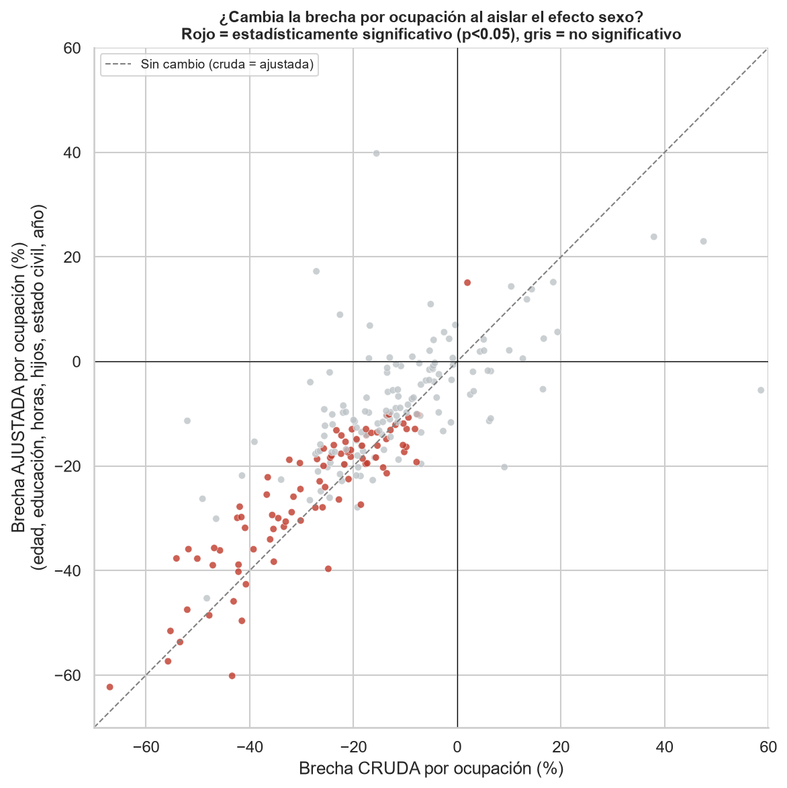
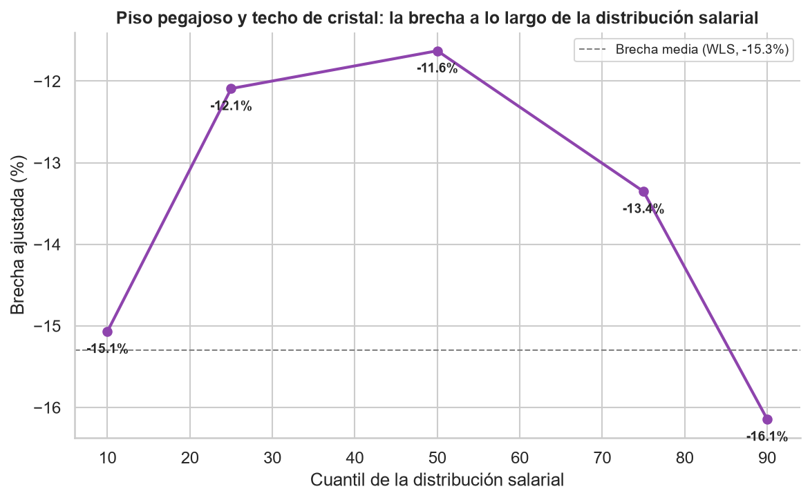
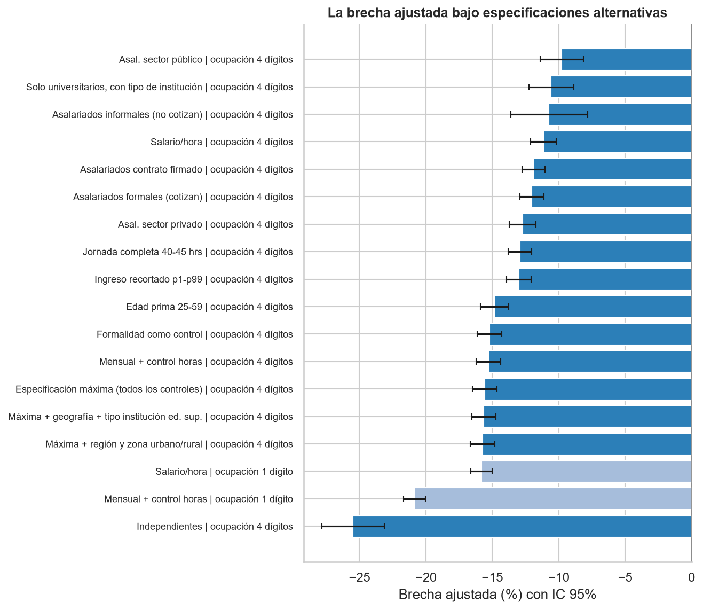

# Misma ocupación, distinto salario

## La brecha de género que la composición no explica: evidencia desde microdatos públicos y propuestas de política para Chile

*Documento de trabajo elaborado a partir de los resultados del repositorio [`brechas-salariales-genero-chile`](https://github.com/W00lscarf/brechas-salariales-genero-chile). Todos los cálculos son reproducibles con datos públicos y código abierto (notebooks 01-10). An English version is available at [README_EN.md](README_EN.md).*

**Julio 2026**

---

## Resumen

Este documento estima la brecha salarial de género en Chile agotando el espacio de explicaciones observables basadas en composición y elección que permiten los datos públicos. Con microdatos de la Encuesta CASEN (2022 y 2024; *n* = 174.924) y de la ESI (2018-2024), se estima el diferencial de ingreso laboral entre hombres y mujeres controlando por ocupación a cuatro dígitos CIUO-08 (354 categorías), horas trabajadas, educación (nivel y tipo de institución), edad, región y zona, régimen de formalidad, sector público o privado, maternidad y estado civil. La brecha ajustada se sitúa entre -11% y -16% en las catorce especificaciones evaluadas y no se reduce al agregar controles: la especificación con el conjunto completo de controles (375 parámetros) arroja -15.6%. La asociación con la maternidad es asimétrica: el mismo hijo se asocia a un premio de +5.0% para los hombres y a una penalización adicional de -7.8% para las mujeres, dentro de la misma ocupación exacta. En el análisis por ocupación, ninguna de las 227 ocupaciones examinadas presenta una brecha favorable a las mujeres que sobreviva la corrección por comparaciones múltiples, mientras que 66 presentan brechas significativas en su contra. La brecha se concentra en los hogares de menor nivel socioeconómico (-21.2%, frente a -11.2% en los de mayor nivel) y exhibe forma de U a lo largo de la distribución salarial. Se concluye que el diferencial chileno corresponde principalmente al componente no explicado por composición observable —retornos, en el sentido de Oaxaca-Blinder— y no a diferencias de composición, y se derivan seis recomendaciones de política.

**Palabras clave:** brecha salarial de género, segregación ocupacional, penalización por maternidad, descomposición de Oaxaca-Blinder, Chile

**Códigos JEL:** J16, J31, J71

---

## Síntesis de resultados y recomendaciones

- Con microdatos públicos de la Encuesta Suplementaria de Ingresos (ESI 2018-2024) y CASEN (2022 y 2024), estimamos que las mujeres ocupadas en Chile ganan en promedio **22-26% menos** que los hombres por su trabajo principal, según fuente y período.
- Controlando simultáneamente por edad, educación, horas trabajadas, año y **ocupación exacta a 4 dígitos CIUO-08** (354 categorías, el control más fino posible con datos públicos chilenos), la brecha ajustada es **-15.3%**. Las horas trabajadas (28.7%) y la ocupación granular (17.0%) son los dos mayores factores de composición identificados, pero la mayoría del diferencial —**en torno a dos tercios**— permanece sin explicar por composición.
- **La penalización por maternidad es identificable y significativa**: dentro de la misma ocupación exacta, una mujer con hijos gana un **7.8% adicional menos** (p < .001) que lo que la brecha general ya le descuenta, mientras que para los hombres tener hijos se asocia a un *premio* salarial (+5.0%). El costo se concentra en mujeres casadas o convivientes.
- Al aislar el efecto sexo ocupación por ocupación, **90 de 227 ocupaciones muestran brecha estadísticamente significativa — 89 en contra de las mujeres y solo una a favor, dentro de lo esperable por azar**. Tras la corrección por comparaciones múltiples, 66 ocupaciones sobreviven la corrección por tasa de falsos descubrimientos (FDR, por su sigla en inglés) y 30 el criterio de Bonferroni — **todas en contra de las mujeres; ninguna a favor**. Las brechas aparentemente favorables a las mujeres que surgen en comparaciones simples no sobreviven el ajuste por composición ni el control de incertidumbre estadística.
- Los resultados sobreviven una **batería de robustez** (sección 7): especificación en salario por hora (-11.1%), restricción a asalariados formales que cotizan (-12.0%), edades centrales 25-59 años (-14.9%), recorte de valores extremos (-13.0%) y tres vectores de referencia en la descomposición. La **especificación máxima** — todos los controles disponibles simultáneamente, incluyendo sector público/privado y formalidad — arroja **-15.6%**: agregar controles no reduce la brecha. La más severa está entre trabajadores independientes (-25.5%); la más baja, en el sector público (-9.8%), donde las escalas salariales la comprimen pero no la eliminan.
- La brecha **no se distribuye de manera homogénea**: duplica su magnitud en los hogares de menor nivel socioeconómico (-21.2%) respecto de los de mayor nivel (-11.2%), y presenta **forma de U** a lo largo de la distribución salarial — piso pegajoso y techo de cristal simultáneos (sección 4.8). Constituye, además, un problema de desigualdad: es mayor donde cada punto porcentual de ingreso tiene mayor impacto en el bienestar.
- Estos resultados indican que la brecha chilena es mayoritariamente atribuible al componente de **retornos** en el sentido de Oaxaca-Blinder (remuneración distinta a iguales características observables) y no solo a la **composición** (dónde trabajan hombres y mujeres). Las políticas deben calibrarse a ese diagnóstico: transparencia salarial con reporte de brechas ajustadas, reforma del artículo 203 del Código del Trabajo (sala cuna), corresponsabilidad parental efectiva y expansión de la oferta pública de cuidado.

---

## 1. Introducción

### 1.1 Motivación y pregunta de investigación

La participación laboral femenina en Chile se sitúa en torno al 53%, unos 18 puntos por debajo de la masculina (INE, 2024), y las mujeres que sí participan ganan sistemáticamente menos. La magnitud reportada de esa brecha varía según la definición: el indicador de la OCDE —que compara medianas de ingreso entre asalariados a jornada completa— arroja cifras inferiores al 10% para Chile, mientras que definiciones más amplias (medias sobre todos los ocupados, incluyendo independientes y jornadas parciales) la sitúan por sobre el 20%, consistente con el promedio mundial ponderado por factores que estima la OIT (2018) en torno al 19%.

Para el diseño de políticas, la magnitud importa menos que la **descomposición**: ¿cuánto de la brecha se debe a que hombres y mujeres trabajan en distintas ocupaciones, sectores y jornadas (*composición*), y cuánto a que características idénticas se remuneran distinto según el sexo (*retornos*)? La respuesta determina el instrumento. Si la brecha fuera principalmente composición, las políticas eficaces serían las de desegregación ocupacional (orientación vocacional, trayectorias formativas en áreas STEM, cuotas). Si es principalmente retornos, se requieren instrumentos que actúen sobre la fijación de salarios: transparencia, fiscalización, negociación y redistribución de los costos del cuidado.

En ese contexto, este documento aborda la pregunta que la literatura chilena ha dejado abierta:

> **¿Persiste la brecha salarial de género en Chile una vez agotado el conjunto completo de explicaciones observables basadas en composición y elección —ocupación exacta, horas trabajadas, educación y su calidad institucional, geografía, régimen de formalidad, sector y estructura familiar— que permiten los datos públicos? Y, de persistir, ¿en qué segmentos de la población es mayor?**

La tesis que este trabajo somete a prueba, y que la evidencia sostiene, es la siguiente: *la brecha salarial de género chilena no es reducible a las elecciones observables de las mujeres. Tras descontar de manera simultánea todas las dimensiones de elección medibles con datos públicos, persiste un diferencial de entre -11% y -16% que no disminuye al agregar controles, que se concentra precisamente en los segmentos donde el margen de elección es menor —hogares de bajo nivel socioeconómico, madres casadas o convivientes y los extremos de la distribución salarial— un patrón consistente con diferencias de retornos —en el sentido de la descomposición de Oaxaca-Blinder— antes que con diferencias de composición observable.*

### 1.2 Contribuciones y relación con la literatura chilena

Este documento aporta a esa discusión con una ventaja metodológica poco frecuente en el debate público chileno: el uso de la ocupación a **4 dígitos de la clasificación CIUO-08** disponible en CASEN, que permite comparar salarios dentro de la misma ocupación específica (médico especialista con médico especialista, técnico en enfermería con técnico en enfermería), en lugar de las aproximadamente nueve categorías amplias que permiten las encuestas de empleo habituales. La crítica estándar a las estimaciones de brecha "ajustada" —que el residuo no explicado sería un artefacto de controles ocupacionales demasiado gruesos— se puede someter a prueba directa. Hasta donde conocemos, los estudios chilenos publicados y los boletines oficiales de brecha salarial trabajan con agrupaciones ocupacionales amplias (1 dígito CIUO o grandes grupos); no identificamos estimaciones publicadas de brechas dentro de la ocupación a 4 dígitos con inferencia estadística y datos de acceso abierto para Chile.

Una precisión de alcance es indispensable: ocupación a cuatro dígitos no equivale a «mismo puesto de trabajo». No observamos la empresa, el cargo jerárquico, el desempeño ni la composición de la remuneración (bonos, comisiones, horas extraordinarias), de modo que el título de este documento debe leerse en sentido estricto: misma *ocupación*, no mismo *empleo* ni «trabajo de igual valor» en el sentido jurídico del término.

Este ejercicio se sitúa, además, cerca del **techo de lo estimable con datos abiertos en el país**: los diseños que la literatura internacional utiliza para ir más lejos —datos administrativos vinculados empleador-empleado, estudios de eventos en torno al nacimiento del primer hijo— requieren fuentes que en Chile existen solo de forma parcial y bajo acceso restringido (los registros del Seguro de Cesantía, usados por ejemplo en Sánchez et al. (2020), cubren únicamente al sector privado formal asalariado; los datos tributarios del SII y los paneles EPS y ELPI tienen restricciones análogas de acceso o cobertura). Esa restricción de infraestructura de datos es, en sí misma, parte del diagnóstico de este documento (recomendación R5).

Los resultados están disponibles en un repositorio público con código y datos de acceso abierto, lo que permite a cualquier investigador o servicio público replicar, auditar y extender las estimaciones.

La literatura chilena ha documentado la magnitud de la brecha y su descomposición con categorías ocupacionales amplias (Ñopo, 2006; Perticará y Bueno, 2009; boletines del INE y de la Subsecretaría del Trabajo), su relación con el poder de mercado de las firmas mediante registros administrativos de acceso restringido y cobertura parcial (Sánchez et al., 2020), los efectos causales de la maternidad con diseño de eventos (Berniell et al., 2021) y, más recientemente, los diferenciales por área de formación (Parada-Contzen y Jara, 2025). La sección 2.6 explicita qué agrega y qué no puede responder este trabajo frente a cada una de esas líneas. Ninguno de estos trabajos estaba en condiciones de descartar la interpretación dominante en el debate público —que el diferencial refleja elecciones ocupacionales, horarias, educativas o familiares de las mujeres—, porque sus controles ocupacionales eran demasiado agregados para someterla a prueba. Frente a ese estado del arte, este documento realiza cuatro contribuciones:

1. **La primera estimación para Chile, hasta donde conocemos, de la brecha salarial dentro de la ocupación a cuatro dígitos** (354 categorías) con datos de acceso abierto, inferencia estadística por ocupación y corrección por comparaciones múltiples.
2. **Un diseño orientado a agotar la explicación por elecciones**: catorce especificaciones que descuentan, sucesiva y conjuntamente, cada dimensión de elección observable — incluida una especificación máxima con 375 parámetros — y una tabla de contraste directo entre cada versión de la objeción y la evidencia (Tabla 6).
3. **La primera caracterización distributiva de la brecha ajustada para Chile con esta granularidad**: gradiente socioeconómico (la brecha duplica su magnitud en los hogares de menor nivel) y forma de U a lo largo de la distribución salarial, con piso pegajoso y techo de cristal simultáneos.
4. **Un aparato empírico íntegramente reproducible con datos públicos**, que establece un estándar replicable para la estadística oficial y fundamenta una agenda de infraestructura de datos (recomendación R5).

### 1.3 Estructura del documento

El resto del documento se organiza como sigue. La sección 2 presenta el marco teórico y las predicciones contrastables que se derivan de él. La sección 3 describe los datos y la estrategia empírica. La sección 4 reporta los resultados: la prueba de granularidad ocupacional, la descomposición de la brecha, la penalización por maternidad, el análisis por ocupación, el contraste sistemático de la interpretación de elecciones y la heterogeneidad distributiva. La sección 5 revisa el marco institucional chileno y sus límites; la sección 6 deriva seis recomendaciones de política; la sección 7 somete los resultados a las pruebas de robustez; la sección 8 examina los mecanismos que la literatura internacional identifica dentro del componente no explicado, y la sección 9 discute las limitaciones.

---

## 2. Marco teórico

### 2.1 Capital humano y la ecuación de salarios

El punto de partida canónico es la función de ingresos de Mincer (1974), que modela el logaritmo del salario como función de la escolaridad y la experiencia potencial. En ese marco, una brecha de género sería atribuible a diferencias en acumulación de capital humano. La evidencia contemporánea descarta esa explicación para las economías de ingreso medio y alto: las mujeres jóvenes igualan o superan a los hombres en escolaridad — patrón que confirmamos para Chile, donde la educación *juega en contra* de la brecha observada (las ocupadas están, en promedio, más educadas que los ocupados).

### 2.2 Descomposición composición/retornos

Oaxaca (1973) y Blinder (1973) formalizaron la descomposición del diferencial salarial en una parte **explicada** por diferencias en características promedio (educación, horas, ocupación) y una parte **no explicada**, atribuible a retornos distintos por sexo sobre las mismas características. Blau y Kahn (2017), en la revisión más citada de esta literatura, documentan para Estados Unidos que el capital humano convencional dejó de explicar la brecha, y que los factores dominantes pasaron a ser la ocupación, la industria y el componente no explicado.

Dos advertencias de interpretación acompañan a esta metodología y aplican a nuestros resultados: (i) el componente "no explicado" no es sinónimo de discriminación — incluye cualquier variable omitida que correlacione con el sexo; (ii) el componente "explicado" tampoco es necesariamente *no discriminatorio* — la segregación ocupacional puede ser, en sí misma, resultado de barreras y normas (Bertrand et al., 2010).

### 2.3 Segregación ocupacional y el problema de la granularidad

Petersen y Morgan (1995) mostraron para Estados Unidos que, al comparar dentro de la misma ocupación *y establecimiento*, la brecha se reduce drásticamente: la mayor parte del diferencial operaría vía segregación — a qué trabajos y empresas acceden hombres y mujeres. Card et al. (2016) refinaron el diagnóstico con datos administrativos portugueses: las mujeres se concentran en firmas que pagan menos y capturan una fracción menor de las rentas de la firma en la negociación.

Esta literatura genera una predicción contrastable para Chile: **si la brecha ajustada chilena fuera principalmente un artefacto de controles ocupacionales gruesos, debería reducirse de manera drástica al controlar por ocupación a 4 dígitos.** Nuestro diseño somete a prueba exactamente esa hipótesis (sección 4.2).

Goldin (2014) aporta el mecanismo complementario: buena parte de la brecha residual dentro de ocupaciones se concentra en trabajos con retornos convexos a las horas — los "trabajos codiciosos" (*greedy jobs*) que pagan desproporcionadamente la disponibilidad total y penalizan la flexibilidad, que las mujeres demandan más por la asignación asimétrica del cuidado (Goldin, 2021).

### 2.4 La penalización por maternidad

La literatura de *child penalties* con estudios de eventos muestra que el nacimiento del primer hijo abre una brecha de ingresos persistente entre madres y padres: alrededor de 20% en el largo plazo en Dinamarca (Kleven et al., 2019) y sustancialmente mayor en América Latina (Kleven et al., 2024). Cortés y Pan (2023) concluyen que los hijos son hoy el factor individual más importante detrás de las brechas de género restantes en los mercados laborales desarrollados. Bertrand et al. (2010) documentan el mecanismo en profesionales de alto ingreso: brecha casi nula al egreso, que se expande tras la llegada de los hijos vía interrupciones y reducción de horas — de las madres, no de los padres.

### 2.5 Discriminación de gustos y estadística

Los modelos clásicos de discriminación por preferencias (Becker, 1957) y discriminación estadística (Phelps, 1972; Arrow, 1973) predicen diferenciales de trato ante productividad idéntica. No podemos identificar discriminación directamente con datos observacionales, pero el diseño de la sección 4.5 —efecto sexo estimado dentro de cada ocupación exacta, neto de edad, educación, horas, hijos y estado civil— acota el espacio de explicaciones alternativas de manera considerablemente más exigente que las estimaciones convencionales.

### 2.6 Posicionamiento frente a la evidencia chilena

Seis líneas de trabajo definen el estado del arte local; conviene explicitar qué agrega y qué no puede responder este documento frente a cada una.

**Estadística oficial (INE/ESI).** Describe brechas brutas por sexo, ocupación amplia, educación y región. Este trabajo agrega el ajuste multivariado con ocupación fina e inferencia estadística; no reemplaza la estadística oficial, y mantiene deliberadamente definiciones compatibles con ella.

**Descomposiciones por emparejamiento (Ñopo, 2006).** Con CASEN 1992-2003 y comparaciones restringidas al soporte común, Ñopo documentó un componente no explicado en torno al 25% del salario femenino promedio, mayor en los percentiles altos de la distribución — plenamente coherente con la forma de U que reportamos. Su método es más exigente en comparabilidad entre individuos; la sección 7.1 implementa esa réplica con ocupación a cuatro dígitos y encuentra que el componente no explicado dentro del soporte común coincide con la estimación por regresión.

**Experiencia laboral efectiva (Perticará y Bueno, 2009).** Con la Encuesta de Protección Social controlaron experiencia real e intermitencia laboral — la variable crítica que nuestra fuente no observa. Frente a esa ventaja, este trabajo aporta actualización (2022-2024), escala muestral, granularidad ocupacional y reproducibilidad con datos abiertos.

**Canal de firma (Sánchez et al., 2020).** Con registros del Seguro de Cesantía y un modelo de monopsonio dinámico estiman diferenciales sustantivos asociados a las elasticidades de oferta laboral hacia la firma. Ese canal es inobservable con nuestros datos y permanece, por construcción, dentro de nuestro componente no explicado.

**Maternidad con diseño de eventos (Berniell et al., 2021).** Para Chile y otros países de la región documentan caídas fuertes y persistentes del empleo, las horas y los ingresos de las madres tras el nacimiento del primer hijo, padres esencialmente inafectados y desplazamiento hacia la informalidad. Nuestros coeficientes transversales de mujer × hijos son la huella estática de ese proceso: coherentes con esa evidencia causal, pero no un sustituto de ella.

**Campos de estudio (Parada-Contzen y Jara, 2025).** Para trabajadores con educación superior documentan brechas de 17-25% con un componente mayoritariamente no explicado, heterogéneo por campo de estudio. El campo capta dimensiones de capital humano que la ocupación no absorbe por completo; integrar área de formación (disponible en CASEN) y ocupación granular en una misma especificación es otra extensión directa.

---

## 3. Datos y metodología

### 3.1 Fuentes

La Tabla 1 resume las fuentes de datos utilizadas.

**Tabla 1**
*Fuentes de datos utilizadas*

| Fuente | Período | Uso |
|---|---|---|
| **ESI** (INE), microdatos públicos | 2018-2024 | Brecha bruta y ajustada anual; descomposición de Oaxaca-Blinder con aproximación de hijos por composición del hogar |
| **CASEN** (Ministerio de Desarrollo Social), microdatos públicos | 2022, 2024 | Ocupación CIUO-08 a 4 dígitos; pregunta directa de fecundidad (`s5`); estado civil (`ecivil`) |

*Nota.* ESI = Encuesta Suplementaria de Ingresos; CASEN = Encuesta de Caracterización Socioeconómica Nacional. Elaboración propia.

Ambas encuestas tienen diseño muestral complejo. Todas las estimaciones usan los **factores de expansión** oficiales (mínimos cuadrados ponderados, WLS) y errores estándar **robustos por conglomerado muestral × año** (`varunit`), siguiendo la recomendación estándar para encuestas de hogares. El ingreso analizado es el del trabajo principal (`ytrabajocor` en CASEN), en logaritmo. CASEN 2017 se excluye del análisis granular porque codifica ocupación en CIUO-88, clasificación no comparable con la CIUO-08 de 2022/2024.

### 3.2 Muestra analítica (CASEN)

Ocupados con ingreso positivo y ocupación válida: **176.542 personas** (2022+2024 combinados), en 444 códigos ocupacionales distintos. Se excluyen los registros con horas semanales inválidas (código -88, "no sabe", y valores sobre 112 horas), lo que deja una muestra analítica de **174.924 personas**; 354 códigos ocupacionales alcanzan n≥30. Para los análisis por ocupación específica se exige además **≥20 hombres y ≥20 mujeres** por celda, lo que deja **227 ocupaciones**.

### 3.3 Estrategia empírica

1. **Regresión minceriana con dos niveles de granularidad.** Misma especificación (`log ingreso ~ mujer + edad + edad² + educación + horas + año`), cambiando únicamente el control ocupacional: 1 dígito CIUO (~9 categorías, lo que permite la ESI) versus 4 dígitos (354 categorías). La diferencia entre ambos coeficientes de `mujer` aísla el aporte puro de la granularidad.
2. **Descomposición de Oaxaca-Blinder ponderada**, agrupando las contribuciones por familia de variable (educación, edad, horas, ocupación, hijos, estado civil, año), para jerarquizar los controles según su contribución a la brecha total.
3. **Interacciones mujer×hijos y mujer×estado civil**, con la pregunta directa de fecundidad de CASEN (a diferencia de la ESI, que exige aproximar maternidad por composición del hogar).
4. **Modelo de interacción completa `mujer × ocupación`** sobre las 227 ocupaciones: los controles comunes se estiman con toda la muestra (aproximadamente 149.000 observaciones) y el efecto sexo se deja variar libremente por ocupación. El efecto por ocupación se recupera como combinación lineal de coeficientes, con varianza calculada desde la matriz de covarianza robusta por conglomerado. Este diseño es más eficiente que estimar 227 regresiones separadas con 50-100 casos cada una.
5. **Batería de robustez** (sección 7): salario por hora, tres vectores de referencia de Oaxaca-Blinder, edades centrales, recorte de valores extremos y separación por formalidad (asalariados formales/informales/independientes, vía categoría ocupacional `o15`, contrato firmado `o19` y cotización previsional `o32`).
6. **Descomposición por emparejamiento exacto con soporte común** (Ñopo, 2008), con bootstrap de 100 réplicas para la inferencia (sección 7.1).

### 3.4 Reproducibilidad

Código completo, figuras y tablas derivadas en el repositorio; los microdatos se descargan gratuitamente de los sitios oficiales del INE y del Observatorio Social del MDS. Ningún dato es de acceso restringido.

---

## 4. Resultados

### 4.1 La brecha bruta apenas se mueve con los controles convencionales (ESI)

Con microdatos ESI 2018-2024 (muestra combinada), la brecha bruta de ingreso medio del trabajo principal es **-22.7%**. Controlando por edad, edad², educación, horas, categoría ocupacional (1 dígito) y sector: **-20.7%** (IC 95%: -21.4 a -20.0). La descomposición de Oaxaca-Blinder con estado civil e hijos (aproximación por composición del hogar) explica el **23.1%** del diferencial; el **76.9% queda sin explicar**. La brecha ajustada y la bruta se mueven casi en paralelo durante los 7 años de la serie: no hay evidencia de que la brecha chilena sea un artefacto de composición del mercado laboral.

### 4.2 La prueba de granularidad: la segregación fina explica una parte real, pero minoritaria

La crítica de Petersen y Morgan aplicada a Chile — ¿desaparece la brecha al comparar ocupaciones exactas? — se responde con CASEN (véase Tabla 2).

**Tabla 2**
*Brecha ajustada según la granularidad del control ocupacional*

| Especificación (idéntica salvo el control ocupacional) | Brecha ajustada | R² |
|---|---|---|
| Ocupación **amplia** (1 dígito, ~9 categorías — equivalente ESI) | **-20.9%** (IC 95%: -21.7 a -20.0) | .488 |
| Ocupación **granular** (4 dígitos, 354 categorías) | **-15.3%** (IC 95%: -16.2 a -14.4) | .537 |
| **Diferencia** | **+5.6 pp** | |

*Nota.* Estimaciones de mínimos cuadrados ponderados con factores de expansión y errores estándar robustos por conglomerado × año. IC = intervalo de confianza; pp = puntos porcentuales. Elaboración propia a partir de CASEN 2022 y 2024.

La granularidad importa: una parte real de lo que las estimaciones convencionales reportan como "no explicado" es **segregación ocupacional fina** — dentro de "Profesionales", los hombres se concentran en las especialidades mejor pagadas. Pero la brecha no se desvanece: **-15.3% persiste comparando la misma ocupación exacta**. Incluso dentro de ocupaciones idénticas: médicos especialistas -20%, técnicos de enfermería -13%, enfermeros -3%.

### 4.3 Jerarquización de factores: qué explica la brecha y cuánto

La Tabla 3 presenta la descomposición de Oaxaca-Blinder de la brecha total de 22.6% (CASEN 2022 y 2024), con y sin controles de composición familiar.

**Tabla 3**
*Descomposición de Oaxaca-Blinder de la brecha salarial total*

| Factor | Sin hijos/estado civil | Con hijos/estado civil |
|---|---|---|
| Horas trabajadas | **+28.7%** | **+27.8%** |
| Ocupación (4 dígitos) | **+17.0%** | **+14.2%** |
| Estado civil | — | +1.8% |
| Tiene hijos | — | -1.4% |
| Edad | -1.1% | -2.0% |
| Educación | **-10.8%** | **-10.9%** |
| Año | -0.4% | -0.4% |
| **No explicado** | **66.6%** | **70.9%** |

*Nota.* Referencia: coeficientes masculinos. Los porcentajes indican la proporción de la brecha total atribuible a la composición de cada factor; los valores negativos corresponden a factores que operan a favor de las mujeres. Elaboración propia a partir de CASEN 2022 y 2024.

Tres lecturas de política se desprenden de esta tabla:

1. **Las horas trabajadas son el mayor factor de composición identificado (cerca del 29% de la brecha), seguidas de la segregación ocupacional fina (cerca del 17%)** — entre ambas dan cuenta de casi toda la parte explicada.
2. **La educación protege**: las ocupadas chilenas están mejor educadas que los ocupados; si solo importara el capital humano, ganarían *más*.
3. **Hijos y estado civil casi no aportan a la parte explicada** — hombres y mujeres no difieren tanto en composición familiar promedio. Su efecto opera por otra vía (sección 4.4).

### 4.4 La penalización por maternidad: una asociación de retornos, no de composición

La Tabla 4 presenta las interacciones mujer × hijos y mujer × estado civil, controlando ocupación exacta, educación, edad, horas y año (*n* = 174.719).

**Tabla 4**
*Efectos de la maternidad y el estado civil sobre el ingreso laboral, por sexo*

| Término | Asociación con el ingreso | Valor p |
|---|---|---|
| Mujer (brecha base) | -12.3% | < .001 |
| Tiene hijos (asociación para hombres) | **+5.0%** | < .001 |
| **Mujer × tiene hijos** | **-7.8%** | **< .001** |
| Mujer × soltera (respecto de casada o conviviente) | +5.3% | < .001 |

*Nota.* Modelo de mínimos cuadrados ponderados con interacciones; categoría de referencia del estado civil: casada o conviviente. Elaboración propia a partir de CASEN 2022 y 2024.

El contraste es nítido: **la paternidad se asocia a un premio salarial; la maternidad, a una penalización adicional** por sobre la brecha que ya afecta a toda mujer — exactamente el patrón que la literatura internacional de *child penalties* documenta con datos administrativos (Kleven et al., 2019; Cortés y Pan, 2023). Notablemente, con datos ESI (sin ocupación granular) esta interacción no era estadísticamente significativa: la granularidad ocupacional fue la que permitió identificarla, lo que sugiere que parte de la penalización por maternidad en Chile opera *dentro* de las ocupaciones y no solo a través de la selección hacia ocupaciones peor pagadas.

Este hallazgo también resuelve la aparente paradoja de la tabla anterior: agregar hijos y estado civil *sube* el "no explicado" (de 66.6% a 70.9%) porque la descomposición solo asigna al componente explicado las diferencias de composición promedio — y la penalización por maternidad es una diferencia de **retorno** (el mismo hijo se asocia a impactos distintos según el sexo del progenitor), no de composición.

Corresponde precisar el estatus inferencial de estos coeficientes: al provenir de un corte transversal en que la maternidad se mide como *stock* autorreportado y no como evento fechado, describen asociaciones condicionales y no efectos causales. Su valor probatorio radica en la coherencia del patrón —asimetría por sexo ante el mismo hecho familiar, dentro de la misma ocupación— con la evidencia causal de estudios de eventos, incluida la disponible para Chile (Berniell et al., 2021; Kleven et al., 2019).

### 4.5 Aislando el efecto sexo ocupación por ocupación

El resultado central del análisis. Con el modelo de interacción completa (efecto sexo específico a cada una de las 227 ocupaciones, neto de edad, educación, horas, hijos, estado civil y año):

- **90 de 227 ocupaciones (39.6%) presentan brecha ajustada estadísticamente significativa (p < .05): 89 en contra de las mujeres y solo 1 a favor** (conductores de buses y trolebuses, +15.1%, p = .029) — exactamente lo que se esperaría del azar, dado que con 227 contrastes simultáneos aproximadamente 11 falsos positivos son esperables a p < .05.
- **Tras la corrección por comparaciones múltiples el resultado se depura**: 66 ocupaciones sobreviven la corrección FDR de Benjamini-Hochberg (q < .05) y 30 sobreviven incluso el criterio de Bonferroni, el más conservador disponible — la totalidad, sin excepción, en contra de las mujeres (la brecha "a favor" en buses no sobrevive: valor p corregido = .08).
- Las aparentes ventajas femeninas de las comparaciones simples se desvanecen al ajustar por composición: joyería pasa de +58.6% crudo a -5.5% ajustado (no significativo); música (+37.9%) y traducción (+47.5%) tampoco son significativas ajustadas (p > .27; celdas de 51 a 143 casos).
- La correlación entre brecha cruda y ajustada es de .79: el orden se conserva, el promedio se modera (de -17.8% a -14.8%; véase Figura 1).

**Figura 1**
*Brecha cruda y brecha ajustada por ocupación*

*Nota.* Cada punto representa una ocupación CIUO-08 a 4 dígitos. En rojo, ocupaciones con brecha ajustada estadísticamente significativa (p < .05); en gris, no significativas. Elaboración propia a partir de CASEN 2022 y 2024.

La distribución completa (227 ocupaciones, con brecha cruda, ajustada, valor p corregido por FDR y tamaños muestrales) está publicada como dato abierto en [`ranking_brecha_ocupacion_ajustada.csv`](../notebooks/outputs/data/ranking_brecha_ocupacion_ajustada.csv).

### 4.6 Síntesis del diagnóstico

La Tabla 5 sintetiza el diagnóstico agregado.

**Tabla 5**
*Síntesis del diagnóstico: componentes de la brecha salarial*

| Componente de la brecha (22.6% total) | Magnitud aproximada | Naturaleza |
|---|---|---|
| Horas trabajadas | ~29% | Composición/preferencias restringidas |
| Segregación ocupacional fina | ~17% | Composición: dónde trabajan |
| Educación | negativa (protege) | Composición |
| Retornos desiguales (incl. penalización por maternidad) | **~2/3** | Remuneración distinta a iguales características observables |

*Nota.* Síntesis de las estimaciones de las secciones 4.1 a 4.5. Elaboración propia.

El problema chileno es, predominantemente, de **retornos** en el sentido de Oaxaca-Blinder: características observables idénticas se asocian a remuneraciones distintas según el sexo, con la maternidad como el mecanismo identificable más claro dentro de ese residuo.

### 4.7 La lectura de "elecciones": qué queda de ella

La interpretación más frecuente para restar urgencia a la brecha salarial es atribuirla a **decisiones libres de las mujeres** — de carrera, de horas, de sector, de familia. El diseño de este trabajo está deliberadamente orientado a someter cada versión de esa lectura a prueba directa (véase Tabla 6).

**Tabla 6**
*Objeciones basadas en la interpretación de elecciones y evidencia que las contrasta*

| La objeción: "es producto de elecciones..." | Prueba aplicada | Resultado |
|---|---|---|
| *...de ocupación: eligen oficios peor pagados* | Control por ocupación exacta a 4 dígitos (354 categorías) | La brecha se reduce (de -20.9% a -15.3%) pero **persiste dentro de la misma ocupación exacta** |
| *...de horas: trabajan menos* | Control de horas + especificación en salario por hora | **-11.1% por hora trabajada**, misma ocupación |
| *...de régimen: prefieren empleos informales o flexibles* | Separación y control por formalidad (contrato, cotización, categoría) | Composición casi idéntica por sexo; **-12.0% entre asalariados formales** |
| *...de sector: optan por el sector público, más compatible* | Separación público/privado | **-9.8% incluso dentro del sector público**, con sus escalas regladas |
| *...familiares: priorizan los hijos sobre la carrera* | Interacción mujer×hijos, mujer×estado civil | **El mismo hijo se asocia a +5.0% para él y -7.8% adicional para ella.** Una "elección familiar" simétrica no produce efectos asimétricos por sexo |
| *...educativas: invierten menos en capital humano o estudian en peores instituciones* | Control por nivel educativo y por tipo de institución de educación superior | Juega al revés: las ocupadas están **más** educadas (contribución -10.3%), y el tipo de institución no mueve el coeficiente. Entre universitarios con tipo de institución controlado: -10.6% |
| *...geográficas: viven en mercados laborales distintos* | Efectos fijos de región (16) y zona urbano/rural | La brecha queda en **-15.7%** — 0.1 puntos porcentuales más que sin controles geográficos |
| *"Es un artefacto estadístico"* | FDR/Bonferroni, valores extremos, forma funcional, referencias de la descomposición | El patrón sobrevive todas las correcciones |

*Nota.* Los valores provienen de las estimaciones de las secciones 4 y 7. Elaboración propia.

Y la prueba de síntesis: la **especificación máxima** — que descuenta simultáneamente todas las "elecciones" observables — no reduce la brecha: la sitúa en -15.6%.

Dos vías de escape permanecen abiertas, y conviene nombrarlas con honestidad. Primero, la **experiencia laboral efectiva**: la edad captura experiencia *potencial*, no trayectorias reales — si las mujeres acumulan menos años efectivos por interrupciones de carrera, parte del residuo lo reflejaría (aunque esas interrupciones son, precisamente, la penalización por maternidad operando por otro canal, no una preferencia). Segundo, la **asignación entre firmas (*sorting*) y la negociación** (Card et al., 2016), inobservable sin datos administrativos vinculados. Ninguna de las dos rescata la lectura de "elecciones libres": la primera es en gran medida consecuencia de la asignación asimétrica del cuidado que este trabajo documenta (el efecto asimétrico de los hijos), y la segunda es un mecanismo de mercado, no una preferencia. A esto se suma que, por el problema de sobre-control (sección 2.2), estas estimaciones son **pisos**: si la segregación ocupacional o las horas son a su vez elecciones restringidas por normas y barreras, parte de lo "explicado" también es discriminación.

### 4.8 ¿Para quién es más grande la brecha? Gradiente socioeconómico y forma de U

La brecha promedio oculta una heterogeneidad de primera importancia para la focalización de políticas (notebook 09, sección 6). Por **nivel socioeconómico del hogar** — medido con el ingreso del *resto* del hogar per cápita, para evitar el sesgo mecánico de que el menor ingreso de las mujeres empuje a sus hogares hacia abajo — la brecha ajustada exhibe un gradiente nítido (véase Tabla 7).

**Tabla 7**
*Brecha ajustada por nivel socioeconómico del hogar y por nivel educativo*

| Corte | Brecha ajustada |
|---|---|
| NSE del hogar: Bajo | **-21.2%** |
| NSE: Medio-bajo | -17.0% |
| NSE: Medio-alto | -15.6% |
| NSE: Alto | **-11.2%** |
| Educación básica | -21.2% |
| Educación media | -19.1% |
| Técnica superior | -16.9% |
| Universitaria | **-8.4%** |
| Posgrado | **-14.6%** |

*Nota.* NSE = nivel socioeconómico, medido mediante quintiles ponderados del ingreso per cápita del resto del hogar (excluido el ingreso laboral de la persona). Todas las estimaciones controlan por ocupación a 4 dígitos, edad, edad², educación, horas trabajadas y año. Elaboración propia a partir de CASEN 2022 y 2024.

(El quintil oficial `qaut` muestra el mismo gradiente: de -22.3% en el primer quintil a -10.5% en el cuarto.)

Tres lecturas de política:

1. **La brecha de género es también un problema de desigualdad.** Es el doble en los hogares de menor NSE que en los de mayor NSE — es mayor precisamente donde cada punto porcentual de ingreso tiene mayor impacto en el bienestar, y donde la mujer tiene menos poder de negociación individual. Las políticas de brecha salarial suelen diseñarse pensando en profesionales de altos ingresos; estos datos indican que la urgencia distributiva está en la base.
2. **El repunte en el posgrado** (-14.6%, frente a -8.4% de las universitarias sin posgrado) es una señal de techo de cristal: las mujeres más calificadas del país enfrentan una brecha casi el doble que las universitarias.
3. **A lo largo de la distribución salarial, la brecha tiene forma de U** (regresión cuantílica con controles completos: en torno a -15% en el decil inferior, -12% en la mediana, -16% en el decil superior; véase Figura 2): Chile exhibe **piso pegajoso y techo de cristal simultáneamente**, el patrón que Albrecht et al. (2003) documentaron para Suecia y Arulampalam et al. (2007) para Europa. La implicancia es que no hay un instrumento único: en la base operan la fiscalización, el salario mínimo y la formalización; en la cima, la transparencia salarial, los criterios objetivos de promoción y la corresponsabilidad.

**Figura 2**
*Brecha ajustada a lo largo de la distribución salarial*

*Nota.* Regresión cuantílica (cuantiles 10 a 90) con el conjunto completo de controles; sin factores de expansión por restricción del método. La línea discontinua indica la brecha media estimada por mínimos cuadrados ponderados. Elaboración propia a partir de CASEN 2022 y 2024.

---

## 5. Marco institucional vigente y sus límites

Chile ratificó el Convenio 100 de la OIT (igualdad de remuneración) en 1971. El instrumento interno principal es la **Ley 20.348 (2009)**, que incorporó el artículo 62 bis al Código del Trabajo: derecho a la igualdad de remuneraciones entre hombres y mujeres que presten "un mismo trabajo". Su diseño presenta tres debilidades documentadas: exige identidad de funciones (no trabajo de igual valor, el estándar OIT), radica la carga de reclamar en la trabajadora individual mediante un procedimiento interno previo, y carece de un mecanismo de reporte que haga observables las brechas. El volumen de denuncias y sanciones ha sido marginal desde su entrada en vigencia.

El **artículo 203 del Código del Trabajo** obliga a financiar sala cuna solo a los empleadores con **20 o más trabajadoras**. Al gravar la contratación femenina en el margen, la norma genera exactamente la distorsión que la teoría predice: Prada et al. (2015) documentan que el costo se traslada a menores salarios de contratación de las mujeres en las firmas afectadas. El proyecto de sala cuna universal que corrige este diseño lleva años en tramitación legislativa.

La **Ley 20.545 (2011)** extendió el postnatal parental a 24 semanas con semanas transferibles al padre; el uso paterno ha sido persistentemente inferior al 1%, lo que en la práctica consolida la asignación asimétrica del cuidado que la literatura identifica como el motor de la penalización por maternidad.

---

## 6. Recomendaciones de política

Las recomendaciones se ordenan por el componente de la brecha sobre el que actúan, siguiendo el diagnóstico de la sección 4.6. En cada caso se distingue el fundamento que proviene de nuestras estimaciones del que descansa en evidencia externa.

### R1. Transparencia salarial obligatoria con brechas ajustadas por ocupación *(actúa sobre: retornos)*

Obligación legal para empresas sobre un umbral de tamaño de calcular y reportar periódicamente su brecha salarial de género **por categoría ocupacional comparable**, con difusión a trabajadores y sindicatos. La evidencia causal de alto estándar es favorable: la ley danesa de reporte redujo la brecha en torno a un 13% relativo, principalmente moderando el crecimiento salarial masculino, sin efectos negativos de empleo (Bennedsen et al., 2022); la transparencia en universidades canadienses la redujo entre 20% y 30% (Baker et al., 2023). Cullen (2024) resume las condiciones de diseño que evitan efectos adversos sobre la negociación individual. La transparencia debe incluir además la **negociabilidad y los rangos salariales de cada cargo**: mostrar referencias salariales del mercado elimina la brecha de peticiones que explica gran parte del diferencial en contrataciones (Roussille, 2024), y explicitar que el salario es negociable elimina la diferencia por sexo en la propensión a negociar (Leibbrandt y List, 2015). La evidencia local apunta en la misma dirección: en el sector público chileno, donde la remuneración se rige por escalas y grados de conocimiento público, la brecha ajustada es menor que en el privado (-9.8% frente a -12.7%; sección 7) — aunque el remanente indica que la transparencia debe cubrir el total de la remuneración (asignaciones, bonos, ascensos), no solo el sueldo base. Complemento legislativo: reformar el art. 62 bis para adoptar el estándar de "trabajo de igual valor" e invertir la carga de la prueba una vez constatada una brecha injustificada en el reporte.

### R2. Sala cuna universal: eliminar el umbral de 20 trabajadoras *(actúa sobre: retornos y participación)*

Sustituir la obligación individual del empleador por un **financiamiento colectivo** (cotización pareja por trabajador, de ambos sexos, o financiamiento fiscal), desacoplando el costo del cuidado infantil de la decisión de contratar mujeres. Es la reforma con la falla de diseño más claramente documentada del sistema actual (Prada et al., 2015) y con el mayor consenso técnico transversal.

### R3. Corresponsabilidad efectiva: cuota paterna intransferible *(actúa sobre: retornos — penalización por maternidad)*

Rediseñar el postnatal parental incorporando **semanas exclusivas del padre no transferibles** (se pierden si no se usan), el instrumento que la evidencia internacional asocia a aumentos sustanciales del uso paterno y a la redistribución persistente del trabajo de cuidado (Patnaik, 2019, para la cuota de Quebec). Dado nuestro hallazgo de que la penalización chilena se concentra en mujeres casadas/convivientes con hijos, redistribuir el costo esperado del cuidado entre ambos progenitores ataca directamente el mecanismo señalizador que la genera.

### R4. Expansión de oferta pública de cuidado y jornada escolar extendida *(actúa sobre: horas y participación)*

La evaluación experimental chilena disponible muestra que el acceso a cuidado después de la jornada escolar aumenta significativamente el empleo materno (Martínez y Perticará, 2017). Dado que las horas trabajadas explican cerca del 29% de la brecha — el mayor factor de composición identificado — y que la restricción horaria es asimétrica por sexo, la expansión de cuidado infantil y de jornada extendida tiene efecto doble: participación y convergencia de horas.

### R5. Estadística pública de brechas ajustadas *(infraestructura de política)*

Que el INE y el MDS publiquen regularmente brechas salariales **ajustadas por ocupación CIUO a 4 dígitos** — este trabajo demuestra que es factible con los datos ya recolectados — y que la ESI incorpore la codificación ocupacional a 4 dígitos en sus microdatos públicos. Sin medición granular oficial, el debate público seguirá anclado en brechas brutas que mezclan composición y retornos, y las brechas "favorables a mujeres" de celdas pequeñas seguirán usándose como contraejemplo sin sustento estadístico.

En la misma línea, establecer **protocolos estables de acceso para investigación a los registros administrativos vinculados** (Seguro de Cesantía, datos previsionales y tributarios, debidamente anonimizados): son la única vía para estudiar los canales de firma (asignación y negociación) y los efectos dinámicos de la maternidad que ni este trabajo ni ninguna encuesta de hogares de corte transversal puede identificar. La experiencia comparada (Dinamarca, Portugal) muestra que las contribuciones más influyentes de la última década en esta agenda descansan sobre esa infraestructura de datos.

### R6. Desegregación ocupacional: necesaria pero no suficiente *(actúa sobre: composición)*

Los programas de orientación vocacional temprana y acceso de mujeres a ocupaciones de alta remuneración (y de hombres a ocupaciones de cuidado) atacan el segundo mayor factor de composición identificado (cerca del 17%). La advertencia empírica de este trabajo: **aun eliminando completamente la segregación ocupacional fina, más del 80% de la brecha permanecería**. La desegregación debe acompañar —no sustituir— a los instrumentos R1-R3.

---

## 7. Análisis de robustez

Los resultados centrales fueron sometidos a la batería de robustez que un proceso de revisión exigiría (notebook 09 del repositorio). La Tabla 8 presenta la brecha ajustada con ocupación granular bajo cada especificación; la Figura 3 la representa gráficamente.

**Tabla 8**
*Brecha ajustada bajo especificaciones alternativas*

| Especificación | Brecha ajustada | *n* |
|---|---|---|
| Especificación de referencia: ingreso mensual + control de horas, todos los ocupados | **-15.3%** | 174.924 |
| **Especificación máxima**: todos los controles simultáneos (ocupación 4d, hijos, estado civil, categoría/sector, cotización; 375 parámetros) | **-15.6%** | 174.719 |
| Máxima + efectos fijos de región (16) y zona urbano/rural | -15.7% | 174.719 |
| Máxima + geografía + tipo de institución de educación superior (CFT/IP/universidades) | -15.6% | 174.719 |
| Solo universitarios y posgraduados, con tipo de institución, región y zona | **-10.6%** | 46.532 |
| Edades centrales (25-59 años) | -14.9% | 135.471 |
| Ingreso recortado de valores extremos (percentiles 1-99) | -13.0% | 171.481 |
| Solo jornada completa (40-45 horas semanales) | -12.9% | 110.716 |
| Solo asalariados formales (cotizan previsión) | **-12.0%** | 110.098 |
| Solo asalariados con contrato escrito firmado | -11.9% | 110.721 |
| Formalidad como control (categoría ocupacional + cotización) | -15.2% | 174.924 |
| Salario por hora (en vez de mensual + control de horas) | **-11.1%** | 174.924 |
| Solo asalariados del sector público | **-9.8%** | 27.222 |
| Solo asalariados del sector privado | -12.7% | 98.163 |
| Solo trabajadores independientes (cuenta propia y empleadores) | **-25.5%** | 44.697 |

*Nota.* Salvo indicación en contrario, todas las especificaciones incluyen control por ocupación a 4 dígitos, factores de expansión y errores estándar robustos por conglomerado × año. Elaboración propia a partir de CASEN 2022 y 2024.

Siete conclusiones de robustez:

1. **La brecha ajustada nunca se acerca a cero — y agregar controles no la reduce**: el rango completo (excluyendo el caso extremo de independientes) va de -11% a -16%. La **especificación máxima**, con todos los controles disponibles simultáneamente, arroja -15.6% — *más* que la especificación de referencia, porque varios controles (educación, formalidad, sector público) capturan composición que favorece a las mujeres; al descontarla, el diferencial atribuible al sexo queda más expuesto. En la descomposición final con todas las familias, la composición explica 27.4% y el 72.6% queda sin explicar. La restricción a jornada completa (40-45 horas, el tramo de la jornada legal) deja la brecha en -12.9%: la heterogeneidad horaria no explica ni una quinta parte del diferencial.
2. **¿Formal con formal?** La comparación restringida a asalariados formales —el mismo universo que cubren los datos administrativos del Seguro de Cesantía— arroja -12.0%. Y la composición por formalidad casi no difiere por sexo en la muestra de ocupados con ingreso (asalariados: 74.6% de los hombres frente a 77.7% de las mujeres; cotización: 73.3% frente a 72.5%): la brecha no es un artefacto de mezclar universos. Incluida como **control** en la muestra completa (categoría ocupacional + cotización), la formalidad apenas mueve el coeficiente de sexo (de -15.3% a -15.2%), pese a ser un fuerte predictor del nivel de ingreso (cotizar se asocia a +30%; cuenta propia, a -19%); en la descomposición, su aporte compositivo es levemente negativo (-1.7%), como el de la educación. El hallazgo nuevo es de heterogeneidad — **la brecha más severa está entre independientes (-25.5%)**, el segmento sin contrato ni fiscalización posible, lo que acota el alcance de los instrumentos regulatorios clásicos (R1) y refuerza el rol de los instrumentos de cuidado (R2-R4), que operan sobre todos los regímenes de empleo.
3. **El problema del número índice (*index number problem*) de la descomposición no altera el diagnóstico**: bajo referencia masculina, femenina o combinada (Neumark, 1988), el ordenamiento de los factores es idéntico (horas primero, ocupación granular segundo, educación en contra); el componente no explicado varía entre 49% y 71% pero nunca baja de aproximadamente la mitad de la brecha.
4. **El patrón unidireccional por ocupación sobrevive al cambio de especificación**: en salario por hora, 41 ocupaciones sobreviven FDR (40 en contra de mujeres) y 16 sobreviven Bonferroni (todas en contra). La única excepción favorable a las mujeres bajo FDR (conductoras de taxis, +13.1% por hora) refleja la dilución horaria de los conductores hombres, que trabajan jornadas extremas — bajo Bonferroni ninguna ocupación favorece a las mujeres en ninguna especificación.
5. En salario por hora la brecha es menor que en ingreso mensual (-11.1% frente a -15.3%): parte de la brecha mensual refleja directamente la menor cantidad de horas remuneradas de las mujeres — coherente con el peso de las horas en la descomposición y con el diagnóstico de Goldin (2014).
6. **El sector público comprime la brecha, pero no la elimina.** Las mujeres están sobrerrepresentadas en el empleo público (56.1% de ese segmento; concentra el 19.0% del empleo femenino frente al 11.0% del masculino), y la brecha ajustada ahí es menor que en el privado: **-9.8% frente a -12.7%** (diferencia marginalmente significativa; interacción mujer×público, p = .078). El patrón es coherente con remuneraciones regidas por escalas y grados públicos — evidencia local a favor de la transparencia salarial (R1) — pero el -9.8% remanente indica que las escalas no bastan: asignaciones, horas extraordinarias y velocidad de ascenso quedan fuera de su alcance.
7. **Ni la geografía ni la calidad de la educación superior explican la brecha.** Los efectos fijos de región y zona urbano/rural dejan el coeficiente en -15.7%, y el tipo de institución de educación superior — que sí predice con fuerza el nivel de ingreso (universidades CRUCH y estatales se asocian a cerca de +20% sobre un centro de formación técnica, a igualdad de todo lo demás) — lo deja en -15.6%. La prueba más fina: **solo entre universitarios y posgraduados**, con tipo de institución, región, zona, ocupación exacta, horas, familia y formalidad controladas, la brecha es **-10.6%**. Nota de datos: CASEN solo registra el *nombre* de la institución para quienes estudian actualmente; para los titulados solo el tipo — el control ideal (efectos fijos por institución×carrera) requiere los registros SIES/Mineduc vinculados a ingresos, otro insumo para R5.

### 7.1 Descomposición por emparejamiento con soporte común

La objeción de comparabilidad más seria contra las brechas ajustadas por regresión es la extrapolación fuera del soporte común bajo una forma funcional impuesta. Siguiendo a Ñopo (2008), replicamos el resultado central con **emparejamiento exacto**: la brecha total se descompone aditivamente en un componente no explicado entre personas comparables (Δ0), diferencias de distribución de características dentro del soporte (ΔX) y las partes atribuibles a hombres y mujeres sin contraparte exacta del otro sexo (ΔM, ΔF). La Tabla 9 presenta el componente no explicado bajo niveles crecientes de exigencia del emparejamiento (notebook 10 del repositorio).

**Tabla 9**
*Componente no explicado (Δ0) de la descomposición de Ñopo, según variables de emparejamiento*

| Emparejamiento exacto por | Celdas en soporte | % de mujeres en soporte | Δ0 (% del salario femenino) | Equivalente en la convención del texto |
|---|---|---|---|---|
| Año + educación + tramo etario | 50 | 100.0 | 34.4% | -25.6% |
| + ocupación (1 dígito) | 433 | 100.0 | 32.6% | -24.6% |
| + ocupación (4 dígitos) | 5.429 | 91.2 | **17.9%** | **-15.2%** |
| + jornada | 7.664 | 82.6 | 13.4% | -11.8% |

*Nota.* Descomposición ponderada por factores de expansión; Δ0 compara hombres y mujeres dentro del soporte común, reponderando la distribución masculina de celdas a la distribución femenina. Intervalo de confianza al 95% por bootstrap (100 réplicas) para Δ0 con ocupación a 4 dígitos: [15.5, 18.8]. La equivalencia se calcula como −Δ0/(1+Δ0). Elaboración propia a partir de CASEN 2022 y 2024.

Tres lecturas se desprenden de la Tabla 9. Primero, **la convergencia de métodos**: el Δ0 con ocupación a 4 dígitos equivale a -15.2% en la convención del texto — prácticamente idéntico a la brecha ajustada por regresión (-15.3%; Tabla 2). Un método no paramétrico, sin supuestos de forma funcional y sin extrapolación fuera del soporte, entrega la misma respuesta que la regresión ponderada. Segundo, **el soporte común es amplio incluso al nivel de 4 dígitos** (80.0% de los hombres y 91.2% de las mujeres, ponderado, con 5.429 celdas emparejadas): la brecha no proviene de comparar personas incomparables. Tercero, la lectura frente a Ñopo (2006) para 1992-2003: sus cifras (en torno al 25% con emparejamiento demográfico) y las nuestras (33-34% en especificaciones demográficas equivalentes; 17.9% con ocupación fina) no son directamente comparables por diferencias de características y período, pero el mensaje conjunto es el mismo — el grueso de la brecha chilena sobrevive a la comparación entre personas equivalentes.

**Figura 3**
*Brecha ajustada bajo especificaciones alternativas, con intervalos de confianza al 95%*

*Nota.* Barras oscuras: especificaciones con ocupación a 4 dígitos. Elaboración propia a partir de CASEN 2022 y 2024.

---

## 8. ¿Qué hay dentro del 72% no explicado? Mecanismos con evidencia causal

El 72.6% que la especificación máxima deja sin explicar no es una caja negra ni un sinónimo automático de "preferencias inobservables". La literatura internacional —con diseños experimentales y datos administrativos que Chile no tiene— ha identificado y cuantificado sus componentes principales:

**8.1 La brecha de peticiones (*ask gap*).** Roussille (2024) documenta, en una plataforma de contratación donde los candidatos publican su pretensión salarial, que las mujeres piden en torno a 3% menos por el mismo perfil — y esa diferencia de *petición* da cuenta de prácticamente toda la brecha en las ofertas finales. El hallazgo de política es notable: cuando la plataforma comenzó a mostrar la mediana salarial de mercado para cada perfil, la brecha de peticiones (y con ella la de ofertas) prácticamente desapareció. En la misma línea, Leibbrandt y List (2015) muestran que cuando la negociabilidad del salario es ambigua los hombres negocian más, y que explicitar "salario negociable" elimina la diferencia. Exley et al. (2020) advierten el reverso: empujar a las mujeres a negociar más no siempre les conviene, porque el castigo por pedir difiere según el sexo — el problema es el *entorno* de negociación, no una deficiencia femenina que corregir.

**8.2 Sobretiempo y flexibilidad: el mecanismo dentro de la ocupación.** Bolotnyy y Emanuel (2022) estudian el caso más limpio disponible: operadores de buses y trenes de Boston — mismo cargo, mismo sindicato, misma tarifa horaria por contrato. Los hombres terminan ganando más porque aceptan más sobretiempo (especialmente el de última hora, mejor pagado) y las mujeres eligen configuraciones horarias compatibles con el cuidado. Es la versión micro del diagnóstico de Goldin (2014) sobre la no-linealidad de los retornos a las horas. Nuestros propios datos muestran la huella de ese mecanismo: las horas son el mayor factor observable de la descomposición (23.3%), y el único caso favorable a las mujeres que sobrevive FDR (conductoras de taxi, en salario por hora) refleja precisamente jornadas masculinas extremas que diluyen el precio-hora.

**8.3 Competencia, riesgo y personalidad.** Niederle y Vesterlund (2007) muestran experimentalmente que, a igual desempeño, el doble de hombres elige compensación por torneo; Buser et al. (2014) documentan que esa disposición predice la elección de carrera — es decir, alimenta la *composición* ocupacional, no solo el residuo. Croson y Gneezy (2009) y Bertrand (2011) revisan las diferencias de preferencias (riesgo, competencia, actitudes sociales); Mueller y Plug (2006) y Heckman et al. (2006) muestran que los atributos de personalidad y las habilidades no cognitivas afectan los salarios. Pero la conclusión agregada de Blau y Kahn (2017) es aleccionadora: **estos factores explican una porción pequeña a moderada de la brecha** — relevante, pero lejos de agotar el residuo. Y una parte de esas "preferencias" es a su vez endógena a normas y expectativas, no un rasgo exógeno.

**8.4 Firmas y negociación.** Card et al. (2016), con datos administrativos portugueses: la combinación de la asignación (*sorting*) hacia firmas que pagan menores premios y menor captura de rentas en la negociación explica en torno a un quinto de la brecha. Este canal es completamente invisible para nuestros datos (no observamos el empleador) y queda, por construcción, dentro de nuestro 72%.

**8.5 La dinámica de la maternidad.** Cortés y Pan (2023) concluyen que los hijos son hoy el principal factor detrás de las brechas restantes en países desarrollados; Kleven et al. (2019, 2024) cuantifican penalizaciones de largo plazo en torno al 20% en Dinamarca y sustancialmente mayores en América Latina. Nuestro coeficiente mujer×hijos (-7.8% transversal) es la huella estática de ese proceso dinámico: la penalización se acumula con los años posteriores al nacimiento, algo que un corte transversal solo puede subestimar.

**Implicancia para Chile.** Ninguno de estos mecanismos es medible hoy con datos públicos chilenos: CASEN y ESI no incluyen módulos de negociación salarial, historia laboral efectiva ni atributos socioemocionales, y la ELPI mide lo socioemocional solo en cuidadores principales de niños pequeños (mayoritariamente mujeres), lo que impide comparar entre sexos. Esto convierte el 72% en un argumento adicional para la recomendación R5: **módulos breves de negociación** (¿negoció su remuneración al ser contratado?, ¿ha pedido un aumento?, ¿el salario era presentado como negociable?) **e historia laboral** en las encuestas existentes tienen costo marginal bajo y abrirían la caja negra local. Mientras tanto, la lectura correcta del residuo no es "diferencias de preferencias inabordables", sino un conjunto de mecanismos con nombre, evidencia y — cada uno — un instrumento de política asociado: transparencia de rangos y negociabilidad (8.1), diseño del sobretiempo y la flexibilidad (8.2), corresponsabilidad en el cuidado (8.5).

---

## 9. Limitaciones

- **Identificación.** Los datos son observacionales y de corte transversal; los coeficientes describen asociaciones condicionales, no efectos causales. El componente "no explicado" acota pero no identifica discriminación.
- **Selección.** La participación laboral femenina es ~18 pp menor; si las mujeres que participan están positivamente seleccionadas en productividad, nuestras brechas *subestiman* el diferencial poblacional. No aplicamos correcciones de selección para mantener la transparencia del pipeline; una cuantificación formal —Heckman con restricciones de exclusión defendibles, cotas a la Manski o ponderación por probabilidad inversa— es la extensión prioritaria de este trabajo.
- **Experiencia potencial, no efectiva.** La edad aproxima experiencia potencial; la evidencia chilena con la Encuesta de Protección Social muestra que la experiencia efectiva y la intermitencia laboral son determinantes de primer orden de la brecha (Perticará y Bueno, 2009). CASEN no registra trayectorias, por lo que parte del residuo puede reflejar diferencias de experiencia efectiva — cuyo origen, a su vez, remite a la asignación asimétrica del cuidado.
- **Diseño muestral.** Las estimaciones ponderan por factor de expansión y agrupan errores por conglomerado × año, pero no incorporan los estratos del diseño (`varstrat`); omitir la estratificación tiende a producir errores estándar conservadores (más amplios), por lo que la inferencia reportada no debería estar sesgada hacia la sobresignificancia. Un apéndice con el diseño muestral completo queda como refinamiento pendiente.
- **Sensibilidad de la descomposición detallada.** Con variables categóricas de alta dimensión, la descomposición de Oaxaca-Blinder es sensible a la elección de categorías base (problema de normalización). Se mitiga aquí agrupando contribuciones por familias de variables y reportando tres vectores de referencia (sección 7); aun así, los porcentajes por factor deben leerse como órdenes de magnitud.
- **Sin dimensión de firma.** No observamos el empleador — ni el cargo jerárquico, el desempeño, los bonos, las comisiones o la negociación individual —, por lo que el canal de asignación entre firmas (*sorting*) y negociación (Card et al., 2016) queda dentro del residuo; «misma ocupación» no equivale a «mismo puesto de trabajo». Datos administrativos vinculados (Seguro de Cesantía, SII) permitirían cerrarlo; su apertura para investigación es en sí misma una recomendación.
- **Maternidad como stock, no como evento.** La pregunta `s5` de CASEN mide haber tenido hijos, no el evento del nacimiento; un estudio de eventos tipo Kleven et al. (2019) exige datos longitudinales. Los paneles chilenos existentes (EPS, ELPI) y los registros del Seguro de Cesantía permitirían aproximarlo, pero ninguno está disponible como dato abierto de propósito general — un estudio de eventos de penalización por maternidad con datos administrativos chilenos sigue siendo, hasta donde conocemos, una vacante en la literatura local.
- **Ingreso autorreportado** y ruptura del clasificador ocupacional (CIUO-88 frente a CIUO-08) que impide extender la serie granular antes de 2022.

---

## 10. Referencias

**Literatura académica**

- Albrecht, J., Björklund, A. y Vroman, S. (2003). Is there a glass ceiling in Sweden? *Journal of Labor Economics*, *21*(1).
- Arrow, K. (1973). The theory of discrimination. En O. Ashenfelter y A. Rees (Eds.), *Discrimination in labor markets*. Princeton University Press.
- Arulampalam, W., Booth, A. y Bryan, M. (2007). Is there a glass ceiling over Europe? Exploring the gender pay gap across the wage distribution. *ILR Review*, *60*(2).
- Baker, M., Halberstam, Y., Kroft, K., Mas, A. y Messacar, D. (2023). Pay transparency and the gender gap. *American Economic Journal: Applied Economics*, *15*(2).
- Becker, G. (1957). *The economics of discrimination*. University of Chicago Press.
- Bennedsen, M., Simintzi, E., Tsoutsoura, M. y Wolfenzon, D. (2022). Do firms respond to gender pay gap transparency? *Journal of Finance*, *77*(4).
- Berniell, I., Berniell, L., de la Mata, D., Edo, M. y Marchionni, M. (2021). *Motherhood and flexible jobs: Evidence from Latin American countries* (Documento de trabajo WIDER). UNU-WIDER.
- Bertrand, M. (2011). New perspectives on gender. En O. Ashenfelter y D. Card (Eds.), *Handbook of labor economics* (Vol. 4B). Elsevier.
- Bertrand, M., Goldin, C. y Katz, L. (2010). Dynamics of the gender gap for young professionals in the financial and corporate sectors. *American Economic Journal: Applied Economics*, *2*(3).
- Blau, F. y Kahn, L. (2017). The gender wage gap: Extent, trends, and explanations. *Journal of Economic Literature*, *55*(3).
- Blinder, A. (1973). Wage discrimination: Reduced form and structural estimates. *Journal of Human Resources*, *8*(4).
- Bolotnyy, V. y Emanuel, N. (2022). Why do women earn less than men? Evidence from bus and train operators. *Journal of Labor Economics*, *40*(2).
- Buser, T., Niederle, M. y Oosterbeek, H. (2014). Gender, competitiveness, and career choices. *Quarterly Journal of Economics*, *129*(3).
- Card, D., Cardoso, A. R. y Kline, P. (2016). Bargaining, sorting, and the gender wage gap: Quantifying the impact of firms on the relative pay of women. *Quarterly Journal of Economics*, *131*(2).
- Cortés, P. y Pan, J. (2023). Children and the remaining gender gaps in the labor market. *Journal of Economic Literature*, *61*(4).
- Croson, R. y Gneezy, U. (2009). Gender differences in preferences. *Journal of Economic Literature*, *47*(2).
- Cullen, Z. (2024). Is pay transparency good? *Journal of Economic Perspectives*, *38*(1).
- Exley, C., Niederle, M. y Vesterlund, L. (2020). Knowing when to ask: The cost of leaning in. *Journal of Political Economy*, *128*(3).
- Goldin, C. (2014). A grand gender convergence: Its last chapter. *American Economic Review*, *104*(4).
- Goldin, C. (2021). *Career and family: Women's century-long journey toward equity*. Princeton University Press.
- Heckman, J., Stixrud, J. y Urzúa, S. (2006). The effects of cognitive and noncognitive abilities on labor market outcomes and social behavior. *Journal of Labor Economics*, *24*(3).
- Kleven, H., Landais, C. y Leite-Mariante, G. (2024). The child penalty atlas. *Review of Economic Studies*.
- Kleven, H., Landais, C. y Søgaard, J. E. (2019). Children and gender inequality: Evidence from Denmark. *American Economic Journal: Applied Economics*, *11*(4).
- Leibbrandt, A. y List, J. (2015). Do women avoid salary negotiations? Evidence from a large-scale natural field experiment. *Management Science*, *61*(9).
- Martínez, C. y Perticará, M. (2017). Childcare effects on maternal employment: Evidence from Chile. *Journal of Development Economics*, *126*.
- Mincer, J. (1974). *Schooling, experience, and earnings*. National Bureau of Economic Research.
- Mueller, G. y Plug, E. (2006). Estimating the effect of personality on male and female earnings. *ILR Review*, *60*(1).
- Niederle, M. y Vesterlund, L. (2007). Do women shy away from competition? Do men compete too much? *Quarterly Journal of Economics*, *122*(3).
- Ñopo, H. (2006). *The gender wage gap in Chile 1992-2003 from a matching comparisons perspective* (Documento de trabajo n.º 468). Banco Interamericano de Desarrollo.
- Ñopo, H. (2008). Matching as a tool to decompose wage gaps. *Review of Economics and Statistics*, *90*(2).
- Oaxaca, R. (1973). Male-female wage differentials in urban labor markets. *International Economic Review*, *14*(3).
- Parada-Contzen, M. y Jara, F. (2025). Gender wage gap among the educated: Evidence from fields of study in Chile. *Humanities and Social Sciences Communications*, *12*.
- Patnaik, A. (2019). Reserving time for daddy: The consequences of fathers' quotas. *Journal of Labor Economics*, *37*(4).
- Perticará, M. y Bueno, I. (2009). A new approach to gender wage gaps in Chile. *Revista CEPAL*, *99*.
- Petersen, T. y Morgan, L. (1995). Separate and unequal: Occupation-establishment sex segregation and the gender wage gap. *American Journal of Sociology*, *101*(2).
- Phelps, E. (1972). The statistical theory of racism and sexism. *American Economic Review*, *62*(4).
- Prada, M. F., Rucci, G. y Urzúa, S. (2015). *The effect of mandated child care on female wages in Chile* (Documento de trabajo NBER n.º 21080). National Bureau of Economic Research.
- Roussille, N. (2024). The central role of the ask gap in gender pay inequality. *Quarterly Journal of Economics*, *139*(3).
- Sánchez, R., Finot, J. y Villena-Roldán, B. (2020). *Gender wage gap and firm market power: Evidence from Chile* (Documento de discusión IZA n.º 13856). Institute of Labor Economics.

**Fuentes oficiales y normativa**

- Instituto Nacional de Estadísticas. (2018-2024). *Encuesta Suplementaria de Ingresos* [microdatos].
- Ley 20.348. (2009). Resguarda el derecho a la igualdad en las remuneraciones. Diario Oficial de la República de Chile.
- Ley 20.545. (2011). Modifica las normas sobre protección a la maternidad e incorpora el permiso postnatal parental. Diario Oficial de la República de Chile.
- Ministerio de Desarrollo Social y Familia. (2022, 2024). *Encuesta de Caracterización Socioeconómica Nacional (CASEN)* [microdatos]. Observatorio Social.
- Organización Internacional del Trabajo. (2018). *Informe mundial sobre salarios 2018/19: ¿Qué hay detrás de la brecha salarial de género?* Oficina Internacional del Trabajo.
- Organización para la Cooperación y el Desarrollo Económicos. (s. f.). *Gender wage gap* [indicador].

---

*Este documento se genera desde un pipeline reproducible. Los notebooks 01-10 del repositorio contienen todos los cálculos citados; las tablas por ocupación están disponibles como CSV en [`notebooks/outputs/data/`](../notebooks/outputs/data/).*
