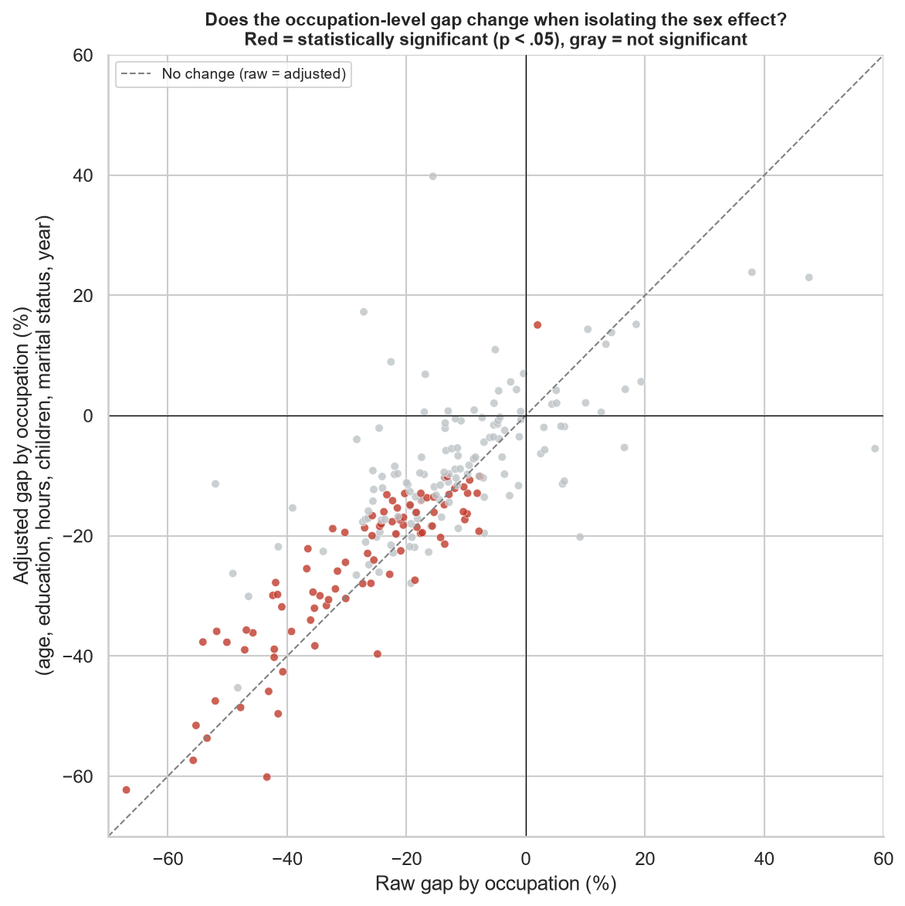
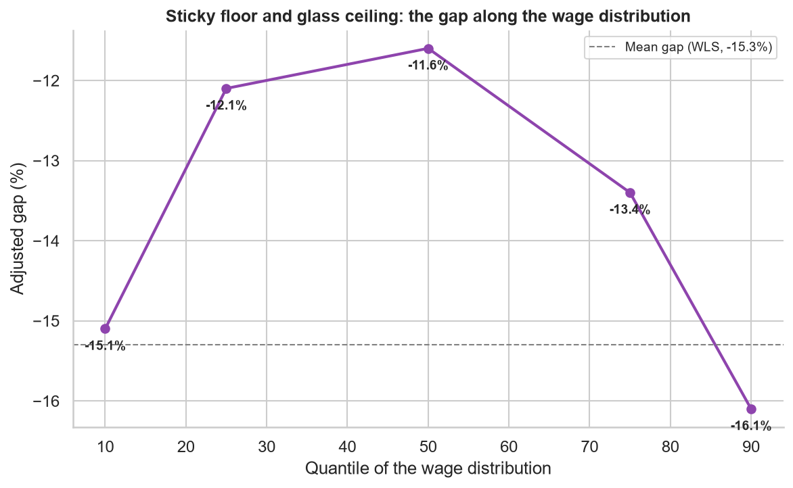
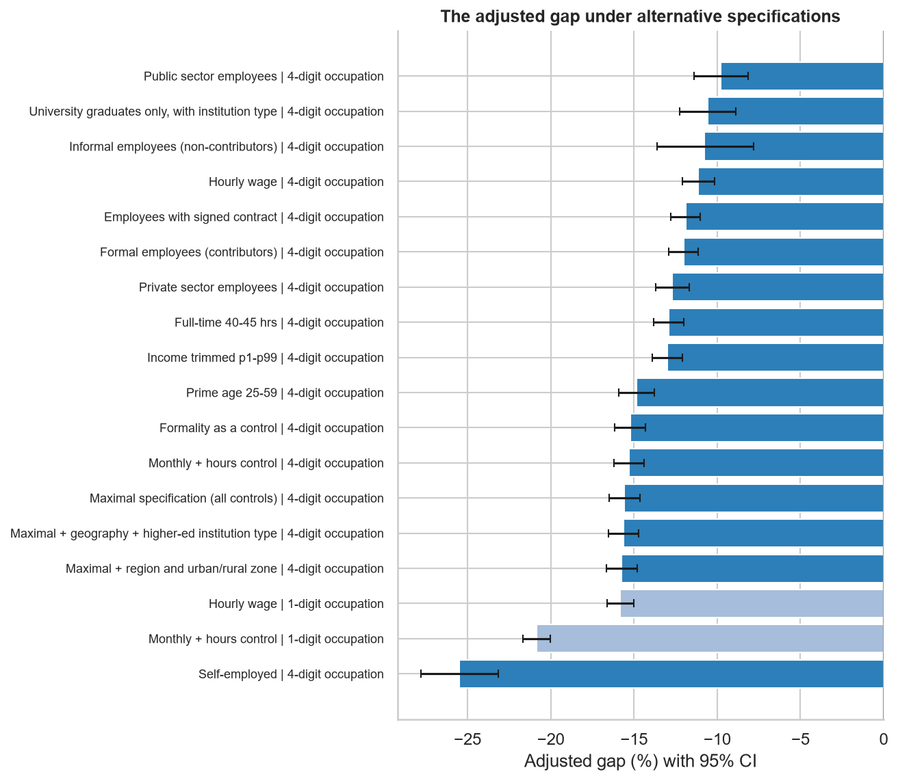

# Same Occupation, Different Pay

## The Gender Gap That Composition Does Not Explain: Evidence From Public Microdata and Policy Proposals for Chile

*Working paper based on the results of the [`brechas-salariales-genero-chile`](https://github.com/W00lscarf/brechas-salariales-genero-chile) repository. All computations are reproducible with public data and open code (notebooks 01-10). Una versión en español está disponible en [README.md](README.md). A submission-ready PDF is available at [same_occupation_different_pay_wp.pdf](same_occupation_different_pay_wp.pdf) (regenerate with `python generar_pdf_en.py`).*

**July 2026**

---

## Abstract

This paper estimates the gender wage gap in Chile by exhausting the space of observable, choice-based compositional explanations that public data allow. Using microdata from the CASEN survey (2022 and 2024; *n* = 174,924) and the ESI survey (2018-2024), we estimate the labor income differential between men and women controlling for 4-digit ISCO-08 occupation (354 categories), hours worked, education (level and type of institution), age, region and urban/rural zone, formality regime, public versus private sector, motherhood, and marital status. The adjusted gap ranges between -11% and -16% across the fourteen specifications evaluated and does not shrink as controls are added: the specification with the full set of controls (375 parameters) yields -15.6%. The association with parenthood is asymmetric: the same child is associated with a +5.0% premium for men and an additional -7.8% penalty for women, within the same exact occupation. In the occupation-level analysis, none of the 227 occupations examined shows a gap favoring women that survives correction for multiple comparisons, whereas 66 show significant gaps against them. The gap is concentrated in households of lower socioeconomic status (-21.2%, versus -11.2% in the highest group) and is U-shaped along the wage distribution. We conclude that the Chilean differential is primarily attributable to the component unexplained by observable composition — returns, in the Oaxaca-Blinder sense — rather than to compositional differences, and derive six policy recommendations.

**Keywords:** gender wage gap, occupational segregation, motherhood penalty, Oaxaca-Blinder decomposition, Chile

**JEL codes:** J16, J31, J71

---

## Summary of Findings and Recommendations

- Using public microdata from the Supplementary Income Survey (ESI 2018-2024) and CASEN (2022 and 2024), we estimate that employed women in Chile earn on average **22-26% less** than men from their main job, depending on source and period.
- Controlling simultaneously for age, education, hours worked, year, and **exact 4-digit ISCO-08 occupation** (354 categories, the finest control possible with Chilean public data), the adjusted gap is **-15.3%**. Hours worked (28.7%) and granular occupation (17.0%) are the two largest compositional factors identified, but most of the differential — **around two thirds** — remains unexplained by composition.
- **The motherhood penalty is identifiable and significant**: within the same exact occupation, a woman with children earns an **additional 7.8% less** (p < .001) beyond the general gap, whereas for men having children is associated with a wage *premium* (+5.0%). The cost is concentrated among married or cohabiting women.
- Isolating the sex effect occupation by occupation, **90 of 227 occupations show a statistically significant gap — 89 against women and only one in their favor, within what chance alone would produce**. After correction for multiple comparisons, 66 occupations survive the false discovery rate (FDR) correction and 30 the Bonferroni criterion — **all against women; none in their favor**. Apparently pro-female gaps arising in simple comparisons survive neither compositional adjustment nor statistical uncertainty controls.
- The results survive a **robustness battery** (Section 7): hourly wage specification (-11.1%), restriction to formal contributing employees (-12.0%), prime age 25-59 (-14.9%), trimming of extreme values (-13.0%), and three reference vectors in the decomposition. The **maximal specification** — all available controls simultaneously, including public/private sector and formality — yields **-15.6%**: adding controls does not reduce the gap. The most severe gap is among self-employed workers (-25.5%); the smallest, in the public sector (-9.8%), where pay scales compress but do not eliminate it.
- The gap is **not evenly distributed**: it doubles in households of lower socioeconomic status (-21.2%) relative to the highest group (-11.2%), and is **U-shaped** along the wage distribution — sticky floor and glass ceiling simultaneously (Section 4.8). It is also an inequality problem: it is largest exactly where each percentage point of income matters most for well-being.
- These results indicate that the Chilean gap is mostly attributable to the **returns component** in the Oaxaca-Blinder sense (different pay for identical observable characteristics) rather than to **composition** alone (where men and women work). Policy should be calibrated to that diagnosis: pay transparency with adjusted-gap reporting, reform of Article 203 of the Labor Code (employer-mandated childcare), effective parental co-responsibility, and expansion of public childcare provision.

---

## 1. Introduction

### 1.1 Motivation and Research Question

Female labor force participation in Chile stands at around 53%, some 18 percentage points below the male rate (INE, 2024), and women who do participate systematically earn less. The reported magnitude of the gap varies with its definition: the OECD indicator — which compares median earnings of full-time employees — yields figures below 10% for Chile, while broader definitions (means over all employed persons, including the self-employed and part-time workers) place it above 20%, consistent with the factor-weighted global average of around 19% estimated by the ILO (2018).

For policy design, the magnitude matters less than the **decomposition**: how much of the gap arises because men and women work in different occupations, sectors, and schedules (*composition*), and how much because identical characteristics are paid differently depending on sex (*returns*)? The answer determines the instrument. If the gap were mainly composition, the effective policies would be those of occupational desegregation (vocational guidance, STEM educational pathways, quotas). If it is mainly returns, instruments acting on wage setting are required: transparency, enforcement, bargaining, and redistribution of care costs.

In this context, this paper addresses the question that the Chilean literature has left open:

> **Does the gender wage gap in Chile persist once the complete set of observable, choice-based compositional explanations — exact occupation, hours worked, education and its institutional quality, geography, formality regime, sector, and family structure — that public data allow has been exhausted? And, if it persists, in which population segments is it largest?**

The thesis this paper tests, and which the evidence supports, is the following: *the Chilean gender wage gap is not reducible to women's observable choices. After simultaneously netting out every dimension of choice measurable with public data, a differential of between -11% and -16% persists that does not shrink as controls are added, that is concentrated precisely in the segments where the scope for choice is smallest — low-socioeconomic-status households, married or cohabiting mothers, and the tails of the wage distribution — a pattern consistent with differences in returns — in the Oaxaca-Blinder sense — rather than with observable compositional differences.*

### 1.2 Contributions and Relation to the Chilean Literature

This paper contributes to the discussion with a methodological advantage that is rare in the Chilean public debate: the use of **4-digit ISCO-08 occupation codes** available in CASEN, which allows wages to be compared within the same specific occupation (medical specialist with medical specialist, nursing technician with nursing technician), instead of the roughly nine broad categories that standard employment surveys permit. The standard critique of "adjusted" gap estimates — that the unexplained residual is an artifact of overly coarse occupational controls — can thus be put to a direct test. To the best of our knowledge, published Chilean studies and official wage gap bulletins work with broad occupational groupings (1-digit ISCO or large groups); we did not identify published estimates of within-occupation gaps at the 4-digit level with statistical inference and openly accessible data for Chile.

A scope clarification is indispensable: 4-digit occupation is not equivalent to "same job." We do not observe the firm, hierarchical position, performance, or the composition of pay (bonuses, commissions, overtime), so the title of this paper must be read strictly: same *occupation*, not same *job*, nor "work of equal value" in the legal sense of the term.

This exercise also sits close to the **ceiling of what can be estimated with open data in the country**: the designs the international literature uses to go further — linked employer-employee administrative data, event studies around first birth — require sources that in Chile exist only partially and under restricted access (the unemployment insurance records used, for example, in Sánchez et al. (2020) cover only formal private-sector employees; SII tax records and the EPS and ELPI panels face analogous access or coverage restrictions). That data infrastructure constraint is itself part of this paper's diagnosis (Recommendation R5).

The results are available in a public repository with open code and data, allowing any researcher or public agency to replicate, audit, and extend the estimates.

The Chilean literature has documented the magnitude of the gap and its decomposition using broad occupational categories (Ñopo, 2006; Perticará & Bueno, 2009; INE and Undersecretariat of Labor bulletins), its relation to firms' market power using restricted-access administrative records of partial coverage (Sánchez et al., 2020), the causal effects of motherhood using event-study designs (Berniell et al., 2021), and, more recently, differentials by field of study (Parada-Contzen & Jara, 2025). Section 2.6 makes explicit what this paper adds and what it cannot answer relative to each of those strands. None of these studies was in a position to rule out the interpretation that dominates the public debate — that the differential reflects women's occupational, hours, educational, or family choices — because their occupational controls were too aggregated to test it. Against that state of the art, this paper makes four contributions:

1. **The first estimate for Chile, to the best of our knowledge, of the wage gap within 4-digit occupations** (354 categories) with openly accessible data, occupation-level statistical inference, and correction for multiple comparisons.
2. **A design aimed at exhausting the choice-based explanation**: fourteen specifications that net out, successively and jointly, every observable dimension of choice — including a maximal specification with 375 parameters — and a table directly confronting each version of the objection with the evidence (Table 6).
3. **The first distributional characterization of the adjusted gap for Chile at this granularity**: a socioeconomic gradient (the gap doubles in the lowest-status households) and a U-shape along the wage distribution, with sticky floor and glass ceiling operating simultaneously.
4. **A fully reproducible empirical apparatus based on public data**, which sets a replicable standard for official statistics and grounds a data infrastructure agenda (Recommendation R5).

### 1.3 Structure of the Paper

The remainder of the paper is organized as follows. Section 2 presents the theoretical framework and the testable predictions derived from it. Section 3 describes the data and the empirical strategy. Section 4 reports the results: the occupational granularity test, the decomposition of the gap, the motherhood penalty, the occupation-level analysis, the systematic confrontation of the choice interpretation, and the distributional heterogeneity. Section 5 reviews the Chilean institutional framework and its limits; Section 6 derives six policy recommendations; Section 7 subjects the results to robustness tests; Section 8 examines the mechanisms the international literature identifies within the unexplained component; and Section 9 discusses limitations.

---

## 2. Theoretical Framework

### 2.1 Human Capital and the Wage Equation

The canonical starting point is the Mincer (1974) earnings function, which models log wages as a function of schooling and potential experience. In that framework, a gender gap would be attributable to differences in human capital accumulation. Contemporary evidence rules out that explanation for middle- and high-income economies: young women match or exceed men in schooling — a pattern we confirm for Chile, where education *works against* the observed gap (employed women are, on average, more educated than employed men).

### 2.2 Composition/Returns Decomposition

Oaxaca (1973) and Blinder (1973) formalized the decomposition of the wage differential into a component **explained** by differences in average characteristics (education, hours, occupation) and an **unexplained** component attributable to different returns to the same characteristics by sex. Blau and Kahn (2017), in the most cited review of this literature, document for the United States that conventional human capital ceased to explain the gap, and that the dominant factors became occupation, industry, and the unexplained component.

Two caveats of interpretation accompany this methodology and apply to our results: (i) the "unexplained" component is not synonymous with discrimination — it includes any omitted variable correlated with sex; (ii) the "explained" component is not necessarily *non-discriminatory* either — occupational segregation may itself be the result of barriers and norms (Bertrand et al., 2010).

### 2.3 Occupational Segregation and the Granularity Problem

Petersen and Morgan (1995) showed for the United States that, comparing within the same occupation *and establishment*, the gap shrinks drastically: most of the differential would operate through segregation — which jobs and firms men and women can access. Card et al. (2016) refined the diagnosis with Portuguese administrative data: women concentrate in low-paying firms and capture a smaller share of firm rents in bargaining.

This literature generates a testable prediction for Chile: **if the Chilean adjusted gap were mainly an artifact of coarse occupational controls, it should fall drastically when controlling for 4-digit occupation.** Our design tests exactly that hypothesis (Section 4.2).

Goldin (2014) supplies the complementary mechanism: much of the residual within-occupation gap concentrates in jobs with convex returns to hours — *greedy jobs* that disproportionately reward total availability and penalize flexibility, which women demand more because of the asymmetric allocation of care (Goldin, 2021).

### 2.4 The Motherhood Penalty

The *child penalties* literature based on event studies shows that the birth of the first child opens a persistent earnings gap between mothers and fathers: around 20% in the long run in Denmark (Kleven et al., 2019) and substantially larger in Latin America (Kleven et al., 2024). Cortés and Pan (2023) conclude that children are today the single most important factor behind the remaining gender gaps in developed labor markets. Bertrand et al. (2010) document the mechanism among high-earning professionals: a near-zero gap at graduation that widens after children arrive, through career interruptions and reduced hours — of mothers, not fathers.

### 2.5 Taste-Based and Statistical Discrimination

The classical models of taste-based discrimination (Becker, 1957) and statistical discrimination (Phelps, 1972; Arrow, 1973) predict differential treatment under identical productivity. We cannot identify discrimination directly with observational data, but the design in Section 4.5 — the sex effect estimated within each exact occupation, net of age, education, hours, children, and marital status — narrows the space of alternative explanations considerably more demandingly than conventional estimates.

### 2.6 Positioning Relative to the Chilean Evidence

Six strands of work define the local state of the art; it is worth making explicit what this paper adds and what it cannot answer relative to each.

**Official statistics (INE/ESI).** They describe raw gaps by sex, broad occupation, education, and region. This paper adds multivariate adjustment with fine occupation and statistical inference; it does not replace official statistics, and deliberately keeps definitions compatible with them.

**Matching decompositions (Ñopo, 2006).** Using CASEN 1992-2003 and comparisons restricted to the common support, Ñopo documented an unexplained component of around 25% of average female wages, larger at the top percentiles of the distribution — fully consistent with the U-shape we report. His method is more demanding in terms of comparability across individuals; Section 7.1 implements that replication with 4-digit occupation and finds that the unexplained component within the common support coincides with the regression estimate.

**Actual labor market experience (Perticará & Bueno, 2009).** Using the Social Protection Survey they controlled for real experience and labor market intermittency — the critical variable our source does not observe. Against that advantage, this paper contributes recency (2022-2024), sample scale, occupational granularity, and reproducibility with open data.

**The firm channel (Sánchez et al., 2020).** Using unemployment insurance records and a dynamic monopsony model, they estimate substantial differentials associated with labor supply elasticities to the firm. That channel is unobservable with our data and remains, by construction, inside our unexplained component.

**Motherhood with event-study designs (Berniell et al., 2021).** For Chile and other countries in the region they document sharp and persistent declines in mothers' employment, hours, and earnings after the first birth, essentially unaffected fathers, and displacement toward informality. Our cross-sectional female × children coefficients are the static imprint of that process: consistent with that causal evidence, but not a substitute for it.

**Fields of study (Parada-Contzen & Jara, 2025).** For workers with higher education they document gaps of 17-25% with a mostly unexplained component, heterogeneous by field of study. Field of study captures human capital dimensions that occupation does not fully absorb; integrating field of study (available in CASEN) and granular occupation in a single specification is another direct extension.

---

## 3. Data and Methods

### 3.1 Sources

Table 1 summarizes the data sources used.

**Table 1**
*Data Sources*

| Source | Period | Use |
|---|---|---|
| **ESI** (INE), public microdata | 2018-2024 | Annual raw and adjusted gap; Oaxaca-Blinder decomposition with household-composition approximation of children |
| **CASEN** (Ministry of Social Development), public microdata | 2022, 2024 | 4-digit ISCO-08 occupation; direct fertility question (`s5`); marital status (`ecivil`) |

*Note.* ESI = Encuesta Suplementaria de Ingresos (Supplementary Income Survey); CASEN = Encuesta de Caracterización Socioeconómica Nacional (National Socioeconomic Characterization Survey). Authors' elaboration.

Both surveys have complex sampling designs. All estimates use the official **expansion factors** (weighted least squares, WLS) and standard errors **robust to clustering by sampling unit × year** (`varunit`), following standard practice for household surveys. The income analyzed is main-job labor income (`ytrabajocor` in CASEN), in logarithm. CASEN 2017 is excluded from the granular analysis because it codes occupation under ISCO-88, which is not comparable with the ISCO-08 coding of 2022/2024.

### 3.2 Analytical Sample (CASEN)

Employed persons with positive income and valid occupation: **176,542 individuals** (2022 and 2024 combined), across 444 distinct occupation codes. Records with invalid weekly hours (code -88, "does not know," and values above 112 hours) are excluded, leaving an analytical sample of **174,924 individuals**; 354 occupation codes reach n ≥ 30. Occupation-specific analyses further require **≥ 20 men and ≥ 20 women** per cell, leaving **227 occupations**.

### 3.3 Empirical Strategy

1. **Mincer regression at two levels of granularity.** The same specification (`log income ~ female + age + age² + education + hours + year`), changing only the occupational control: 1-digit ISCO (roughly nine categories, what ESI allows) versus 4 digits (354 categories). The difference between the two `female` coefficients isolates the pure contribution of granularity.
2. **Weighted Oaxaca-Blinder decomposition**, grouping contributions by variable family (education, age, hours, occupation, children, marital status, year), to rank controls by their contribution to the total gap.
3. **Female × children and female × marital status interactions**, using CASEN's direct fertility question (unlike ESI, which requires approximating motherhood from household composition).
4. **Full interaction model `female × occupation`** over the 227 occupations: common controls are estimated on the full sample (approximately 149,000 observations) and the sex effect is allowed to vary freely by occupation. The occupation-specific effect is recovered as a linear combination of coefficients, with variance computed from the cluster-robust covariance matrix. This design is more efficient than estimating 227 separate regressions with 50-100 cases each.
5. **Robustness battery** (Section 7): hourly wages, three Oaxaca-Blinder reference vectors, prime age, trimming of extreme values, and separation by formality (formal/informal employees and the self-employed, via occupational category `o15`, signed contract `o19`, and pension contributions `o32`).
6. **Exact-matching decomposition with common support** (Ñopo, 2008), with a 100-replication bootstrap for inference (Section 7.1).

### 3.4 Reproducibility

Full code, figures, and derived tables are in the repository; the microdata are downloaded free of charge from the official INE and Social Observatory websites. No data source is access-restricted.

---

## 4. Results

### 4.1 The Raw Gap Barely Moves With Conventional Controls (ESI)

With ESI 2018-2024 microdata (combined sample), the raw gap in mean main-job income is **-22.7%**. Controlling for age, age², education, hours, occupational category (1 digit), and sector: **-20.7%** (95% CI: -21.4 to -20.0). The Oaxaca-Blinder decomposition with marital status and children (household-composition approximation) explains **23.1%** of the differential; **76.9% remains unexplained**. The adjusted and raw gaps move almost in parallel over the seven years of the series: there is no evidence that the Chilean gap is an artifact of labor market composition.

### 4.2 The Granularity Test: Fine Segregation Explains a Real but Minor Share

The Petersen and Morgan critique applied to Chile — does the gap vanish when comparing exact occupations? — is answered with CASEN (see Table 2).

**Table 2**
*Adjusted Gap by Granularity of the Occupational Control*

| Specification (identical except for the occupational control) | Adjusted gap | R² |
|---|---|---|
| **Broad** occupation (1 digit, ~9 categories — ESI equivalent) | **-20.9%** (95% CI: -21.7 to -20.0) | .488 |
| **Granular** occupation (4 digits, 354 categories) | **-15.3%** (95% CI: -16.2 to -14.4) | .537 |
| **Difference** | **+5.6 pp** | |

*Note.* Weighted least squares estimates with expansion factors and standard errors clustered by sampling unit × year. CI = confidence interval; pp = percentage points. Authors' elaboration based on CASEN 2022 and 2024.

Granularity matters: a real share of what conventional estimates report as "unexplained" is **fine occupational segregation** — within "Professionals," men concentrate in the better-paid specialties. But the gap does not vanish: **-15.3% persists comparing the same exact occupation**. Even within identical occupations: medical specialists -20%, nursing technicians -13%, nurses -3%.

### 4.3 Ranking of Factors: What Explains the Gap, and How Much

Table 3 presents the Oaxaca-Blinder decomposition of the total gap of 22.6% (CASEN 2022 and 2024), with and without family-composition controls.

**Table 3**
*Oaxaca-Blinder Decomposition of the Total Wage Gap*

| Factor | Without children/marital status | With children/marital status |
|---|---|---|
| Hours worked | **+28.7%** | **+27.8%** |
| Occupation (4 digits) | **+17.0%** | **+14.2%** |
| Marital status | — | +1.8% |
| Has children | — | -1.4% |
| Age | -1.1% | -2.0% |
| Education | **-10.8%** | **-10.9%** |
| Year | -0.4% | -0.4% |
| **Unexplained** | **66.6%** | **70.9%** |

*Note.* Reference: male coefficients. Percentages indicate the share of the total gap attributable to the composition of each factor; negative values correspond to factors operating in women's favor. Authors' elaboration based on CASEN 2022 and 2024.

Three policy readings follow from this table:

1. **Hours worked are the largest compositional factor identified (about 29% of the gap), followed by fine occupational segregation (about 17%)** — together they account for nearly all of the explained share.
2. **Education protects**: employed Chilean women are more educated than employed men; if human capital alone mattered, they would earn *more*.
3. **Children and marital status contribute almost nothing to the explained share** — men and women do not differ much in average family composition. Their effect operates through another channel (Section 4.4).

### 4.4 The Motherhood Penalty: A Returns-Side Association, Not a Composition Effect

Table 4 presents the female × children and female × marital status interactions, controlling for exact occupation, education, age, hours, and year (*n* = 174,719).

**Table 4**
*Effects of Motherhood and Marital Status on Labor Income, by Sex*

| Term | Association with income | p value |
|---|---|---|
| Female (base gap) | -12.3% | < .001 |
| Has children (association for men) | **+5.0%** | < .001 |
| **Female × has children** | **-7.8%** | **< .001** |
| Female × single (relative to married or cohabiting) | +5.3% | < .001 |

*Note.* Weighted least squares model with interactions; marital status reference category: married or cohabiting. Authors' elaboration based on CASEN 2022 and 2024.

The contrast is stark: **fatherhood is associated with a wage premium; motherhood, with an additional penalty** on top of the gap that already affects all women — exactly the pattern the international *child penalties* literature documents with administrative data (Kleven et al., 2019; Cortés & Pan, 2023). Notably, with ESI data (without granular occupation) this interaction was not statistically significant: occupational granularity is what made it identifiable, suggesting that part of the Chilean motherhood penalty operates *within* occupations and not only through selection into lower-paid occupations.

This finding also resolves the apparent paradox of the previous table: adding children and marital status *raises* the "unexplained" share (from 66.6% to 70.9%) because the decomposition assigns to the explained component only differences in average composition — and the motherhood penalty is a difference in **returns** (the same child is associated with different impacts depending on the parent's sex), not in composition.

The inferential status of these coefficients deserves precision: coming from a cross-section in which motherhood is measured as a self-reported *stock* rather than a dated event, they describe conditional associations, not causal effects. Their evidentiary value lies in the coherence of the pattern — sex asymmetry in response to the same family event, within the same occupation — with the causal evidence from event studies, including that available for Chile (Berniell et al., 2021; Kleven et al., 2019).

### 4.5 Isolating the Sex Effect Occupation by Occupation

The central result of the analysis. With the full interaction model (a sex effect specific to each of the 227 occupations, net of age, education, hours, children, marital status, and year):

- **90 of 227 occupations (39.6%) show a statistically significant adjusted gap (p < .05): 89 against women and only 1 in their favor** (bus and trolleybus drivers, +15.1%, p = .029) — exactly what chance would produce, given that with 227 simultaneous tests approximately 11 false positives are expected at p < .05.
- **Correction for multiple comparisons purges the result**: 66 occupations survive the Benjamini-Hochberg FDR correction (q < .05) and 30 survive even the Bonferroni criterion, the most conservative available — all of them, without exception, against women (the "pro-female" gap among bus drivers does not survive: corrected p value = .08).
- The apparent female advantages in simple comparisons dissolve under compositional adjustment: jewelry goes from +58.6% raw to -5.5% adjusted (not significant); music (+37.9%) and translation (+47.5%) are likewise not significant once adjusted (p > .27; cells of 51 to 143 cases).
- The correlation between raw and adjusted gaps is .79: the ordering is preserved, the average moderates (from -17.8% to -14.8%; see Figure 1).

**Figure 1**
*Raw and Adjusted Gap by Occupation*

*Note.* Each point represents a 4-digit ISCO-08 occupation. Red: occupations with a statistically significant adjusted gap (p < .05); gray: not significant. Authors' elaboration based on CASEN 2022 and 2024.

The complete distribution (227 occupations, with raw gap, adjusted gap, FDR-corrected p value, and sample sizes) is published as open data in [`ranking_brecha_ocupacion_ajustada.csv`](../notebooks/outputs/data/ranking_brecha_ocupacion_ajustada.csv).

### 4.6 Summary of the Diagnosis

Table 5 summarizes the aggregate diagnosis.

**Table 5**
*Summary of the Diagnosis: Components of the Wage Gap*

| Component of the gap (22.6% total) | Approximate magnitude | Nature |
|---|---|---|
| Hours worked | ~29% | Composition/constrained preferences |
| Fine occupational segregation | ~17% | Composition: where people work |
| Education | negative (protects) | Composition |
| Unequal returns (incl. motherhood penalty) | **~2/3** | Differential pay for identical observable characteristics |

*Note.* Summary of the estimates in Sections 4.1 to 4.5. Authors' elaboration.

The Chilean problem is predominantly one of **returns** in the Oaxaca-Blinder sense: identical observable characteristics are associated with different pay by sex, with motherhood as the most clearly identifiable mechanism within that residual.

### 4.7 The "Choices" Interpretation: What Remains of It

The most frequent interpretation used to downplay the wage gap attributes it to **women's free choices** — of career, hours, sector, family. The design of this study is deliberately aimed at putting each version of that reading to a direct test (see Table 6).

**Table 6**
*Choice-Based Objections and the Evidence Confronting Them*

| The objection: "it is the product of choices..." | Test applied | Result |
|---|---|---|
| *...of occupation: women choose lower-paid lines of work* | Control for exact 4-digit occupation (354 categories) | The gap shrinks (from -20.9% to -15.3%) but **persists within the same exact occupation** |
| *...of hours: women work fewer hours* | Hours control + hourly wage specification | **-11.1% per hour worked**, same occupation |
| *...of regime: women prefer informal or flexible jobs* | Separation and control by formality (contract, contributions, category) | Nearly identical composition by sex; **-12.0% among formal employees** |
| *...of sector: women opt for the more compatible public sector* | Public/private separation | **-9.8% even within the public sector**, with its regulated pay scales |
| *...of family: women prioritize children over careers* | Female × children, female × marital status interactions | **The same child is associated with +5.0% for him and an additional -7.8% for her.** A symmetric "family choice" does not produce sex-asymmetric effects |
| *...of education: women invest less in human capital or attend worse institutions* | Control for educational level and type of higher education institution | It runs the other way: employed women are **more** educated (contribution -10.3%), and institution type does not move the coefficient. Among university graduates with institution type controlled: -10.6% |
| *...of geography: women live in different labor markets* | Fixed effects for region (16) and urban/rural zone | The gap stands at **-15.7%** — 0.1 percentage points more than without geographic controls |
| *"It is a statistical artifact"* | FDR/Bonferroni, extreme values, functional form, decomposition references | The pattern survives every correction |

*Note.* Values come from the estimates in Sections 4 and 7. Authors' elaboration.

And the synthesis test: the **maximal specification** — which simultaneously nets out all observable "choices" — does not reduce the gap: it places it at -15.6%.

Two escape routes remain open, and it is worth naming them honestly. First, **actual labor market experience**: age captures *potential* experience, not real trajectories — if women accumulate fewer effective years due to career interruptions, part of the residual would reflect that (although those interruptions are precisely the motherhood penalty operating through another channel, not a preference). Second, **between-firm sorting and bargaining** (Card et al., 2016), unobservable without linked administrative data. Neither rescues the "free choices" reading: the first is largely a consequence of the asymmetric allocation of care that this study documents (the asymmetric child effect), and the second is a market mechanism, not a preference. To this must be added that, because of the over-control problem (Section 2.2), these estimates are **floors**: if occupational segregation or hours are themselves choices constrained by norms and barriers, part of the "explained" share is also discrimination.

### 4.8 For Whom Is the Gap Largest? Socioeconomic Gradient and U-Shape

The average gap conceals heterogeneity of first-order importance for policy targeting (notebook 09, Section 6). By **household socioeconomic status** — measured with the per capita income of the *rest* of the household, to avoid the mechanical bias whereby women's lower earnings push their own households down the ranking — the adjusted gap displays a clear gradient (see Table 7).

**Table 7**
*Adjusted Gap by Household Socioeconomic Status and by Educational Level*

| Segment | Adjusted gap |
|---|---|
| Household SES: Low | **-21.2%** |
| SES: Lower-middle | -17.0% |
| SES: Upper-middle | -15.6% |
| SES: High | **-11.2%** |
| Primary education | -21.2% |
| Secondary education | -19.1% |
| Technical tertiary | -16.9% |
| University | **-8.4%** |
| Postgraduate | **-14.6%** |

*Note.* SES = socioeconomic status, measured through weighted quintiles of the per capita income of the rest of the household (excluding the person's own labor income). All estimates control for 4-digit occupation, age, age², education, hours worked, and year. Authors' elaboration based on CASEN 2022 and 2024.

(The official quintile `qaut` shows the same gradient: from -22.3% in the first quintile to -10.5% in the fourth.)

Three policy readings:

1. **The gender gap is also an inequality problem.** It is twice as large in low-SES households as in high-SES ones — it is largest precisely where each percentage point of income has the greatest impact on well-being, and where women have the least individual bargaining power. Wage gap policies tend to be designed with high-income professionals in mind; these data indicate that the distributional urgency lies at the bottom.
2. **The rebound at the postgraduate level** (-14.6%, versus -8.4% for university graduates without postgraduate studies) is a glass ceiling signal: the country's most qualified women face a gap nearly twice that of university graduates.
3. **Along the wage distribution, the gap is U-shaped** (quantile regression with full controls: around -15% at the bottom decile, -12% at the median, -16% at the top decile; see Figure 2): Chile exhibits **a sticky floor and a glass ceiling simultaneously**, the pattern that Albrecht et al. (2003) documented for Sweden and Arulampalam et al. (2007) for Europe. The implication is that there is no single instrument: at the bottom operate enforcement, the minimum wage, and formalization; at the top, pay transparency, objective promotion criteria, and co-responsibility.

**Figure 2**
*Adjusted Gap Along the Wage Distribution*

*Note.* Quantile regression (quantiles 10 to 90) with the full set of controls; without expansion factors due to method constraints. The dashed line indicates the mean gap estimated by weighted least squares. Authors' elaboration based on CASEN 2022 and 2024.

---

## 5. Current Institutional Framework and Its Limits

Chile ratified ILO Convention 100 (equal remuneration) in 1971. The main domestic instrument is **Law No. 20,348 (2009)**, which incorporated Article 62 bis into the Labor Code: the right to equal pay between men and women performing "the same work." Its design exhibits three documented weaknesses: it requires identity of functions (not work of equal value, the ILO standard), it places the burden of claiming on the individual worker through a prior internal procedure, and it lacks a reporting mechanism that would make gaps observable. The volume of complaints and sanctions has been marginal since its entry into force.

**Article 203 of the Labor Code** obliges only employers with **20 or more female workers** to fund childcare. By taxing female hiring at the margin, the rule generates exactly the distortion theory predicts: Prada et al. (2015) document that the cost is passed through to lower starting wages for women in affected firms. The universal childcare bill that would correct this design has been under legislative discussion for years.

**Law No. 20,545 (2011)** extended parental postnatal leave to 24 weeks with weeks transferable to the father; paternal take-up has persistently remained below 1%, which in practice consolidates the asymmetric allocation of care that the literature identifies as the engine of the motherhood penalty.

---

## 6. Policy Recommendations

The recommendations are ordered by the component of the gap on which they act, following the diagnosis in Section 4.6. In each case, we distinguish grounds derived from our own estimates from those resting on external evidence.

### R1. Mandatory Pay Transparency With Occupation-Adjusted Gaps *(acts on: returns)*

A legal obligation for firms above a size threshold to compute and periodically report their gender pay gap **by comparable occupational category**, with disclosure to workers and unions. High-standard causal evidence is favorable: the Danish reporting law reduced the gap by around 13% in relative terms, mainly by moderating male wage growth, without negative employment effects (Bennedsen et al., 2022); transparency in Canadian universities reduced it by between 20% and 30% (Baker et al., 2023). Cullen (2024) summarizes the design conditions that avoid adverse effects on individual bargaining. Transparency should also cover the **negotiability and salary ranges of each position**: displaying market wage references eliminates the ask gap that accounts for much of the differential in hiring (Roussille, 2024), and making it explicit that pay is negotiable eliminates the sex difference in the propensity to negotiate (Leibbrandt & List, 2015). Local evidence points in the same direction: in the Chilean public sector, where pay is governed by publicly known scales and grades, the adjusted gap is smaller than in the private sector (-9.8% versus -12.7%; Section 7) — although the remainder indicates that transparency must cover total remuneration (allowances, bonuses, promotions), not just base pay. A legislative complement: reform Article 62 bis to adopt the "work of equal value" standard and shift the burden of proof once an unjustified gap has been established in the report.

### R2. Universal Childcare: Eliminate the 20-Worker Threshold *(acts on: returns and participation)*

Replace the employer's individual obligation with **collective financing** (a flat per-worker contribution, for both sexes, or fiscal funding), decoupling the cost of childcare from the decision to hire women. This is the reform with the most clearly documented design flaw in the current system (Prada et al., 2015) and the broadest technical consensus.

### R3. Effective Co-Responsibility: A Non-Transferable Paternal Quota *(acts on: returns — motherhood penalty)*

Redesign parental postnatal leave to include **father-exclusive, non-transferable weeks** (lost if unused), the instrument the international evidence associates with substantial increases in paternal take-up and a persistent redistribution of care work (Patnaik, 2019, for the Quebec quota). Given our finding that the Chilean penalty concentrates among married or cohabiting women with children, redistributing the expected cost of care between both parents attacks directly the signaling mechanism that generates it.

### R4. Expansion of Public Care Provision and Extended School Hours *(acts on: hours and participation)*

The available Chilean experimental evaluation shows that access to after-school care significantly increases maternal employment (Martínez & Perticará, 2017). Given that hours worked explain close to 29% of the gap — the largest compositional factor identified — and that the hours constraint is asymmetric by sex, expanding childcare and extended school schedules has a double effect: participation and convergence in hours.

### R5. Official Statistics on Adjusted Gaps *(policy infrastructure)*

The INE and the Ministry of Social Development should regularly publish wage gaps **adjusted by 4-digit ISCO occupation** — this study demonstrates it is feasible with data already collected — and the ESI should incorporate 4-digit occupational coding into its public microdata. Without official granular measurement, the public debate will remain anchored in raw gaps that mix composition and returns, and the "pro-female" gaps of small cells will continue to be used as counterexamples without statistical support.

Along the same lines, establish **stable research access protocols for linked administrative records** (unemployment insurance, pension, and tax records, duly anonymized): they are the only way to study the firm channels (sorting and bargaining) and the dynamic effects of motherhood that neither this study nor any cross-sectional household survey can identify. Comparative experience (Denmark, Portugal) shows that the most influential contributions of the last decade in this agenda rest on that data infrastructure.

### R6. Occupational Desegregation: Necessary but Not Sufficient *(acts on: composition)*

Early vocational guidance programs and women's access to high-paying occupations (and men's to care occupations) attack the second-largest compositional factor identified (close to 17%). The empirical caveat from this study: **even if fine occupational segregation were completely eliminated, more than 80% of the gap would remain**. Desegregation must accompany — not substitute for — instruments R1-R3.

---

## 7. Robustness Analysis

The central results were subjected to the robustness battery that a review process would demand (notebook 09 of the repository). Table 8 presents the adjusted gap with granular occupation under each specification; Figure 3 displays it graphically.

**Table 8**
*Adjusted Gap Under Alternative Specifications*

| Specification | Adjusted gap | *n* |
|---|---|---|
| Reference specification: monthly income + hours control, all employed | **-15.3%** | 174,924 |
| **Maximal specification**: all controls simultaneously (4-digit occupation, children, marital status, category/sector, contributions; 375 parameters) | **-15.6%** | 174,719 |
| Maximal + region (16) and urban/rural zone fixed effects | -15.7% | 174,719 |
| Maximal + geography + type of higher education institution | -15.6% | 174,719 |
| University graduates only, with institution type, region, and zone | **-10.6%** | 46,532 |
| Prime age (25-59 years) | -14.9% | 135,471 |
| Income trimmed of extreme values (percentiles 1-99) | -13.0% | 171,481 |
| Full-time only (40-45 weekly hours) | -12.9% | 110,716 |
| Formal employees only (pension contributors) | **-12.0%** | 110,098 |
| Employees with signed written contract only | -11.9% | 110,721 |
| Formality as a control (occupational category + contributions) | -15.2% | 174,924 |
| Hourly wage (instead of monthly + hours control) | **-11.1%** | 174,924 |
| Public sector employees only | **-9.8%** | 27,222 |
| Private sector employees only | -12.7% | 98,163 |
| Self-employed only (own-account workers and employers) | **-25.5%** | 44,697 |

*Note.* Unless otherwise indicated, all specifications include 4-digit occupation controls, expansion factors, and standard errors clustered by sampling unit × year. Authors' elaboration based on CASEN 2022 and 2024.

Seven robustness conclusions:

1. **The adjusted gap never approaches zero — and adding controls does not reduce it**: the full range (excluding the extreme case of the self-employed) runs from -11% to -16%. The **maximal specification**, with all available controls simultaneously, yields -15.6% — *more* than the reference specification, because several controls (education, formality, public sector) capture composition that favors women; once it is netted out, the differential attributable to sex is even more exposed. In the final decomposition with all families, composition explains 27.4% and 72.6% remains unexplained. Restricting to full-time work (40-45 hours, the legal workweek band) leaves the gap at -12.9%: hours heterogeneity does not explain even a fifth of the differential.
2. **Formal versus formal?** The comparison restricted to formal employees — the same universe covered by unemployment insurance administrative data — yields -12.0%. Formality composition barely differs by sex among employed income earners (employees: 74.6% of men versus 77.7% of women; contributing: 73.3% versus 72.5%): the gap is not an artifact of mixing universes. Included as a **control** on the full sample (occupational category + contributions), formality barely moves the sex coefficient (from -15.3% to -15.2%), despite being a strong predictor of income levels (contributing is associated with +30%; own-account work, with -19%); in the decomposition, its compositional contribution is slightly negative (-1.7%), like education's. The novel finding is heterogeneity — **the most severe gap is among the self-employed (-25.5%)**, the segment without contracts or enforceable regulation, which bounds the reach of classical regulatory instruments (R1) and reinforces the role of care instruments (R2-R4), which operate across all employment regimes.
3. **The index number problem of the decomposition does not alter the diagnosis**: under male, female, or pooled reference coefficients (Neumark, 1988), the ordering of factors is identical (hours first, granular occupation second, education working in the opposite direction); the unexplained component varies between 49% and 71% but never falls below roughly half of the gap.
4. **The one-directional occupation-level pattern survives the change of specification**: in hourly wages, 41 occupations survive FDR (40 against women) and 16 survive Bonferroni (all against women). The only female-favorable exception under FDR (taxi drivers, +13.1% per hour) reflects the hours dilution of male drivers, who work extreme schedules — under Bonferroni no occupation favors women in any specification.
5. In hourly wages the gap is smaller than in monthly income (-11.1% versus -15.3%): part of the monthly gap directly reflects women's fewer paid hours — consistent with the weight of hours in the decomposition and with Goldin's (2014) diagnosis.
6. **The public sector compresses the gap but does not eliminate it.** Women are overrepresented in public employment (56.1% of that segment; it concentrates 19.0% of female employment versus 11.0% of male employment), and the adjusted gap there is smaller than in the private sector: **-9.8% versus -12.7%** (a marginally significant difference; female × public interaction, p = .078). The pattern is consistent with pay governed by public scales and grades — local evidence in favor of pay transparency (R1) — but the remaining -9.8% indicates that scales are not enough: allowances, overtime, and promotion speed lie beyond their reach.
7. **Neither geography nor the quality of higher education explains the gap.** Region and urban/rural fixed effects leave the coefficient at -15.7%, and the type of higher education institution — which does strongly predict income levels (Council of Rectors and state universities are associated with around +20% over a technical training center, all else equal) — leaves it at -15.6%. The finest test: **among university graduates and postgraduates only**, with institution type, region, zone, exact occupation, hours, family, and formality controlled, the gap is **-10.6%**. Data note: CASEN records the institution's *name* only for those currently studying; for graduates, only the type — the ideal control (institution × program fixed effects) requires the SIES/Ministry of Education records linked to earnings, another input for R5.

### 7.1 Matching Decomposition With Common Support

The most serious comparability objection against regression-adjusted gaps is extrapolation outside the common support under an imposed functional form. Following Ñopo (2008), we replicate the central result with **exact matching**: the total gap decomposes additively into an unexplained component between comparable individuals (Δ0), differences in the distribution of characteristics within the support (ΔX), and the parts attributable to men and women without an exact counterpart of the other sex (ΔM, ΔF). Table 9 presents the unexplained component under increasingly demanding matching sets (notebook 10 of the repository).

**Table 9**
*Unexplained Component (Δ0) of the Ñopo Decomposition, by Matching Variables*

| Exact matching on | Cells in support | % of women in support | Δ0 (% of female wage) | Equivalent in the text's convention |
|---|---|---|---|---|
| Year + education + age band | 50 | 100.0 | 34.4% | -25.6% |
| + occupation (1 digit) | 433 | 100.0 | 32.6% | -24.6% |
| + occupation (4 digits) | 5,429 | 91.2 | **17.9%** | **-15.2%** |
| + workweek band | 7,664 | 82.6 | 13.4% | -11.8% |

*Note.* Decomposition weighted by expansion factors; Δ0 compares men and women within the common support, reweighting the male cell distribution to the female one. Bootstrap 95% confidence interval (100 replications) for Δ0 with 4-digit occupation: [15.5, 18.8]. The equivalence is computed as −Δ0/(1+Δ0). Authors' elaboration based on CASEN 2022 and 2024.

Three readings follow from Table 9. First, **the convergence of methods**: Δ0 with 4-digit occupation is equivalent to -15.2% in the text's convention — practically identical to the regression-adjusted gap (-15.3%; Table 2). A nonparametric method, with no functional form assumptions and no extrapolation outside the support, delivers the same answer as the weighted regression. Second, **the common support is wide even at the 4-digit level** (80.0% of men and 91.2% of women, weighted, across 5,429 matched cells): the gap does not arise from comparing incomparable individuals. Third, the reading against Ñopo (2006) for 1992-2003: his figures (around 25% with demographic matching) and ours (33-34% in equivalent demographic specifications; 17.9% with fine occupation) are not directly comparable given different characteristic sets and periods, but the joint message is the same — the bulk of the Chilean gap survives comparison between equivalent individuals.

**Figure 3**
*Adjusted Gap Under Alternative Specifications, With 95% Confidence Intervals*

*Note.* Dark bars: specifications with 4-digit occupation. Authors' elaboration based on CASEN 2022 and 2024.

---

## 8. What Lies Inside the Unexplained 72%? Mechanisms With Causal Evidence

The 72.6% that the maximal specification leaves unexplained is neither a black box nor an automatic synonym for "unobservable preferences." The international literature — with experimental designs and administrative data that Chile lacks — has identified and quantified its main components:

**8.1 The ask gap.** Roussille (2024) documents, on a hiring platform where candidates post their desired salary, that women ask for about 3% less for the same profile — and that difference in *asks* accounts for essentially the entire gap in final offers. The policy finding is remarkable: when the platform began displaying the market median salary for each profile, the ask gap (and with it the offer gap) essentially disappeared. In the same vein, Leibbrandt and List (2015) show that when the negotiability of pay is ambiguous men negotiate more, and that stating "salary negotiable" eliminates the difference. Exley et al. (2020) warn of the flip side: pushing women to negotiate more does not always benefit them, because the penalty for asking differs by sex — the problem is the negotiation *environment*, not a female deficiency to be corrected.

**8.2 Overtime and flexibility: the within-occupation mechanism.** Bolotnyy and Emanuel (2022) study the cleanest available case: bus and train operators in Boston — same job, same union, same contractual hourly rate. Men end up earning more because they take more overtime (especially last-minute overtime, which pays better) while women choose schedules compatible with care. It is the micro version of Goldin's (2014) diagnosis on the nonlinearity of returns to hours. Our own data show the imprint of that mechanism: hours are the largest observable factor in the decomposition (23.3%), and the only female-favorable case that survives FDR (taxi drivers, in hourly wages) reflects precisely extreme male schedules that dilute the hourly rate.

**8.3 Competition, risk, and personality.** Niederle and Vesterlund (2007) show experimentally that, at equal performance, twice as many men choose tournament compensation; Buser et al. (2014) document that this disposition predicts career choice — that is, it feeds occupational *composition*, not only the residual. Croson and Gneezy (2009) and Bertrand (2011) review preference differences (risk, competition, social attitudes); Mueller and Plug (2006) and Heckman et al. (2006) show that personality traits and noncognitive skills affect wages. But the aggregate conclusion of Blau and Kahn (2017) is sobering: **these factors explain a small-to-moderate share of the gap** — relevant, but far from exhausting the residual. And part of those "preferences" is itself endogenous to norms and expectations, not an exogenous trait.

**8.4 Firms and bargaining.** Card et al. (2016), with Portuguese administrative data: the combination of sorting into low-premium firms and lower rent capture in bargaining explains about one fifth of the gap. This channel is entirely invisible to our data (we do not observe the employer) and sits, by construction, inside our 72%.

**8.5 The dynamics of motherhood.** Cortés and Pan (2023) conclude that children are today the main factor behind the remaining gaps in developed countries; Kleven et al. (2019, 2024) quantify long-run penalties of around 20% in Denmark and substantially larger in Latin America. Our female × children coefficient (-7.8%, cross-sectional) is the static imprint of that dynamic process: the penalty accumulates over the years following birth, something a cross-section can only underestimate.

**Implication for Chile.** None of these mechanisms is measurable today with Chilean public data: CASEN and ESI include no modules on wage negotiation, actual work histories, or socioemotional attributes, and the ELPI measures socioemotional traits only for primary caregivers of young children (mostly women), precluding comparison across sexes. This turns the 72% into an additional argument for Recommendation R5: **short negotiation modules** (did you negotiate your pay when hired? have you asked for a raise? was the salary presented as negotiable?) **and work history modules** in existing surveys have low marginal cost and would open the local black box. In the meantime, the correct reading of the residual is not "intractable preference differences," but a set of mechanisms with names, evidence, and — each one — an associated policy instrument: transparency of ranges and negotiability (8.1), overtime and flexibility design (8.2), co-responsibility in care (8.5).

---

## 9. Limitations

- **Identification.** The data are observational and cross-sectional; the coefficients describe conditional associations, not causal effects. The "unexplained" component bounds but does not identify discrimination.
- **Selection.** Female labor force participation is about 18 percentage points lower; if participating women are positively selected on productivity, our gaps *underestimate* the population differential. We do not apply selection corrections in order to keep the pipeline transparent; a formal quantification — Heckman with defensible exclusion restrictions, Manski-style bounds, or inverse probability weighting — is the priority extension of this work.
- **Potential, not actual, experience.** Age proxies potential experience; Chilean evidence using the Social Protection Survey shows that actual experience and labor market intermittency are first-order determinants of the gap (Perticará & Bueno, 2009). CASEN does not record trajectories, so part of the residual may reflect differences in actual experience — whose origin, in turn, traces back to the asymmetric allocation of care.
- **Survey design.** Estimates are weighted by expansion factors and cluster standard errors by sampling unit × year, but do not incorporate the design strata (`varstrat`); omitting stratification tends to produce conservative (wider) standard errors, so the reported inference should not be biased toward over-significance. An appendix with the full survey design remains a pending refinement.
- **Sensitivity of the detailed decomposition.** With high-dimensional categorical variables, the Oaxaca-Blinder decomposition is sensitive to the choice of base categories (the normalization problem). It is mitigated here by grouping contributions into variable families and reporting three reference vectors (Section 7); even so, factor-level percentages should be read as orders of magnitude.
- **No firm dimension.** We do not observe the employer — nor hierarchical position, performance, bonuses, commissions, or individual bargaining — so the between-firm sorting and bargaining channel (Card et al., 2016) remains inside the residual; "same occupation" is not equivalent to "same job." Linked administrative data (unemployment insurance, SII) would close it; opening them for research is itself a recommendation.
- **Motherhood as a stock, not an event.** CASEN's `s5` question measures ever having had children, not the birth event; an event study in the style of Kleven et al. (2019) requires longitudinal data. Chile's existing panels (EPS, ELPI) and the unemployment insurance records could approximate it, but none is available as general-purpose open data — an event study of the motherhood penalty with Chilean administrative data remains, to the best of our knowledge, a vacancy in the local literature.
- **Self-reported income** and the occupational classifier break (ISCO-88 versus ISCO-08), which prevents extending the granular series before 2022.

---

## 10. References

**Academic literature**

- Albrecht, J., Björklund, A., & Vroman, S. (2003). Is there a glass ceiling in Sweden? *Journal of Labor Economics*, *21*(1).
- Arrow, K. (1973). The theory of discrimination. In O. Ashenfelter & A. Rees (Eds.), *Discrimination in labor markets*. Princeton University Press.
- Arulampalam, W., Booth, A., & Bryan, M. (2007). Is there a glass ceiling over Europe? Exploring the gender pay gap across the wage distribution. *ILR Review*, *60*(2).
- Baker, M., Halberstam, Y., Kroft, K., Mas, A., & Messacar, D. (2023). Pay transparency and the gender gap. *American Economic Journal: Applied Economics*, *15*(2).
- Becker, G. (1957). *The economics of discrimination*. University of Chicago Press.
- Bennedsen, M., Simintzi, E., Tsoutsoura, M., & Wolfenzon, D. (2022). Do firms respond to gender pay gap transparency? *Journal of Finance*, *77*(4).
- Berniell, I., Berniell, L., de la Mata, D., Edo, M., & Marchionni, M. (2021). *Motherhood and flexible jobs: Evidence from Latin American countries* (WIDER Working Paper). UNU-WIDER.
- Bertrand, M. (2011). New perspectives on gender. In O. Ashenfelter & D. Card (Eds.), *Handbook of labor economics* (Vol. 4B). Elsevier.
- Bertrand, M., Goldin, C., & Katz, L. (2010). Dynamics of the gender gap for young professionals in the financial and corporate sectors. *American Economic Journal: Applied Economics*, *2*(3).
- Blau, F., & Kahn, L. (2017). The gender wage gap: Extent, trends, and explanations. *Journal of Economic Literature*, *55*(3).
- Blinder, A. (1973). Wage discrimination: Reduced form and structural estimates. *Journal of Human Resources*, *8*(4).
- Bolotnyy, V., & Emanuel, N. (2022). Why do women earn less than men? Evidence from bus and train operators. *Journal of Labor Economics*, *40*(2).
- Buser, T., Niederle, M., & Oosterbeek, H. (2014). Gender, competitiveness, and career choices. *Quarterly Journal of Economics*, *129*(3).
- Card, D., Cardoso, A. R., & Kline, P. (2016). Bargaining, sorting, and the gender wage gap: Quantifying the impact of firms on the relative pay of women. *Quarterly Journal of Economics*, *131*(2).
- Cortés, P., & Pan, J. (2023). Children and the remaining gender gaps in the labor market. *Journal of Economic Literature*, *61*(4).
- Croson, R., & Gneezy, U. (2009). Gender differences in preferences. *Journal of Economic Literature*, *47*(2).
- Cullen, Z. (2024). Is pay transparency good? *Journal of Economic Perspectives*, *38*(1).
- Exley, C., Niederle, M., & Vesterlund, L. (2020). Knowing when to ask: The cost of leaning in. *Journal of Political Economy*, *128*(3).
- Goldin, C. (2014). A grand gender convergence: Its last chapter. *American Economic Review*, *104*(4).
- Goldin, C. (2021). *Career and family: Women's century-long journey toward equity*. Princeton University Press.
- Heckman, J., Stixrud, J., & Urzúa, S. (2006). The effects of cognitive and noncognitive abilities on labor market outcomes and social behavior. *Journal of Labor Economics*, *24*(3).
- Kleven, H., Landais, C., & Leite-Mariante, G. (2024). The child penalty atlas. *Review of Economic Studies*.
- Kleven, H., Landais, C., & Søgaard, J. E. (2019). Children and gender inequality: Evidence from Denmark. *American Economic Journal: Applied Economics*, *11*(4).
- Leibbrandt, A., & List, J. (2015). Do women avoid salary negotiations? Evidence from a large-scale natural field experiment. *Management Science*, *61*(9).
- Martínez, C., & Perticará, M. (2017). Childcare effects on maternal employment: Evidence from Chile. *Journal of Development Economics*, *126*.
- Mincer, J. (1974). *Schooling, experience, and earnings*. National Bureau of Economic Research.
- Mueller, G., & Plug, E. (2006). Estimating the effect of personality on male and female earnings. *ILR Review*, *60*(1).
- Niederle, M., & Vesterlund, L. (2007). Do women shy away from competition? Do men compete too much? *Quarterly Journal of Economics*, *122*(3).
- Ñopo, H. (2006). *The gender wage gap in Chile 1992-2003 from a matching comparisons perspective* (Working Paper No. 468). Inter-American Development Bank.
- Ñopo, H. (2008). Matching as a tool to decompose wage gaps. *Review of Economics and Statistics*, *90*(2).
- Oaxaca, R. (1973). Male-female wage differentials in urban labor markets. *International Economic Review*, *14*(3).
- Parada-Contzen, M., & Jara, F. (2025). Gender wage gap among the educated: Evidence from fields of study in Chile. *Humanities and Social Sciences Communications*, *12*.
- Patnaik, A. (2019). Reserving time for daddy: The consequences of fathers' quotas. *Journal of Labor Economics*, *37*(4).
- Perticará, M., & Bueno, I. (2009). A new approach to gender wage gaps in Chile. *CEPAL Review*, *99*.
- Petersen, T., & Morgan, L. (1995). Separate and unequal: Occupation-establishment sex segregation and the gender wage gap. *American Journal of Sociology*, *101*(2).
- Phelps, E. (1972). The statistical theory of racism and sexism. *American Economic Review*, *62*(4).
- Prada, M. F., Rucci, G., & Urzúa, S. (2015). *The effect of mandated child care on female wages in Chile* (NBER Working Paper No. 21080). National Bureau of Economic Research.
- Roussille, N. (2024). The central role of the ask gap in gender pay inequality. *Quarterly Journal of Economics*, *139*(3).
- Sánchez, R., Finot, J., & Villena-Roldán, B. (2020). *Gender wage gap and firm market power: Evidence from Chile* (IZA Discussion Paper No. 13856). Institute of Labor Economics.

**Official sources and legislation**

- Instituto Nacional de Estadísticas. (2018-2024). *Encuesta Suplementaria de Ingresos* [Supplementary Income Survey; microdata].
- Law No. 20,348. (2009). Resguarda el derecho a la igualdad en las remuneraciones [Safeguards the right to equal pay]. Diario Oficial de la República de Chile.
- Law No. 20,545. (2011). Modifica las normas sobre protección a la maternidad e incorpora el permiso postnatal parental [Amends maternity protection rules and introduces parental postnatal leave]. Diario Oficial de la República de Chile.
- Ministerio de Desarrollo Social y Familia. (2022, 2024). *Encuesta de Caracterización Socioeconómica Nacional (CASEN)* [National Socioeconomic Characterization Survey; microdata]. Observatorio Social.
- Organisation for Economic Co-operation and Development. (n.d.). *Gender wage gap* [Indicator].
- International Labour Organization. (2018). *Global wage report 2018/19: What lies behind gender pay gaps*. International Labour Office.

---

*This document is generated from a reproducible pipeline. Notebooks 01-10 of the repository contain all the computations cited; the occupation-level tables are available as CSV files in [`notebooks/outputs/data/`](../notebooks/outputs/data/).*
